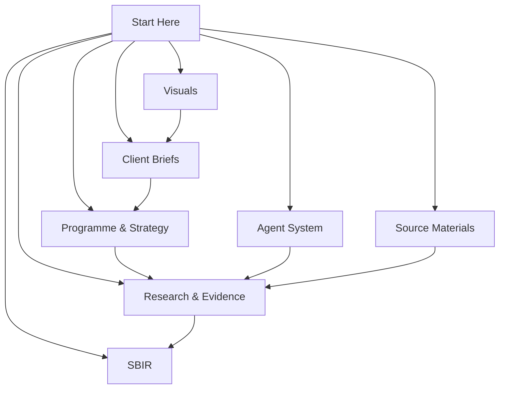

# Freight Trust Knowledge Base

This is the canonical navigation layer for the Freight Trust research programme. It consolidates client materials, research evidence, the agent operating system, SBIR preparation, source records, and reusable visualizations into an Obsidian-ready vault.

> [!important] Working convention
> Treat notes in this vault as the organized working copy. The workspace folders outside this vault remain preserved source material; do not silently edit both copies. Update the vault first, then deliberately propagate any finalized material outward if needed.

## Start with the right path

| If you need to… | Open |
|---|---|
| Understand the client request and programme at a glance | [[Client Request & Outcomes]] → [[01 Client Briefs/Client Briefs MOC]] |
| Prepare an external conversation | [[01 Client Briefs/Freight Trust Client Master Brief]] |
| Prepare an NSF application | [[04 SBIR/NSF SBIR STTR Process and Readiness Guide]] → [[04 SBIR/SBIR MOC]] |
| Verify a research claim | [[03 Research & Evidence/Research & Evidence MOC]] → [[03 Research & Evidence/evidence]] |
| Run the Terra/Luna/Rabbit workflow | [[05 Agent System/Agent System MOC]] |
| Review source inputs without treating them as validated evidence | [[06 Source Materials/Source Materials MOC]] |
| Reuse a diagram | [[07 Visuals/Visual Index]] |

## Vault topology

## Core notes

- [[01 Client Briefs/Freight Trust Client Master Brief]] — current client-facing narrative.
- [[02 Programme & Strategy/Research Programme]] — complete research programme and logic.
- [[03 Research & Evidence/evidence]] — source-backed evidence register and confidence record.
- [[04 SBIR/NSF SBIR STTR Process and Readiness Guide]] — application route, draft Pitch, and checklist.
- [[05 Agent System/FRAMEWORK]] — Terra orchestration, Luna synthesis, and Rabbit discovery control plane.

## Status at a glance

| Area | Current state | Next decision |
|---|---|---|
| Client narrative | Consolidated | Confirm priority audience and first pilot workflow. |
| Evidence | Sourced baseline assembled | Add primary interviews and permissioned benchmark data. |
| SBIR | Full draft package: Pitch, project description, budget, DMP, commercialization plan, risk register (all placeholder-gated) | Confirm applicant entity, PI, and SBIR/STTR route to resolve placeholders. |
| Agents | Framework, roles, and skill contract documented | Use the task-packet loop for each new research pass. |

