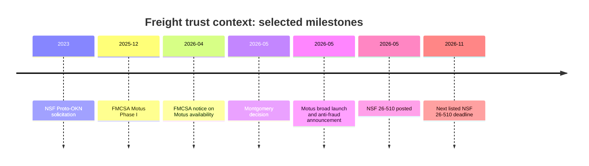

# Freight Trust Infrastructure: Landscape and SBIR Readiness Brief

**Prepared for:** Client and prospective pilot partners  
**Purpose:** Provide clear-eyed context for entering the freight-trust space and a practical route toward an NSF SBIR/STTR proposal.

## What this brief answers

This brief responds directly to two client needs:

1. Understand the freight-trust landscape, including who matters, where pushback will
   come from, and what current regulatory and legal shifts mean.
2. Identify a credible NSF SBIR/STTR research angle and the material needed to pursue it.

The answer is not that “everyone is ready.” Public evidence supports a real identity,
detention, and interoperability problem; it does not prove universal willingness to share
commercial data. A viable programme must earn participation with limited disclosure,
reciprocal value, and credible governance.

## Bottom line

The strongest opportunity is not another closed freight platform or a universal risk score.
It is a **federated evidence infrastructure** that helps participants verify counterparties
and establish permissioned, traceable operating events. Its early value should be faster,
more explainable verification and better detention-event records. Fraud reduction, reduced
detention, and fewer empty miles are pilot outcomes to measure—not promises to make today.

## Market and policy context

### The operational need

ATRI's 2023 detention analysis estimated that 39.3% of stops involved detention, resulting
in 135.9 million lost hours, $3.6 billion in direct expenses, and $11.5 billion in
productivity losses for for-hire trucking. These are industry estimates, not a federal
census, but they establish a material measurement and coordination problem. [ATRI study record](https://trid.trb.org/View/2427471)

FMCSA is actively researching how detention can be measured and separated from ordinary
dwell time, a sign that the evidence base remains incomplete. [FMCSA research](https://www.fmcsa.dot.gov/research-and-analysis/impact-driver-detention-time-safety-and-operations)

### The identity and fraud context

GAO previously identified coverage and resource constraints in FMCSA's efforts to detect
freight carriers that may evade enforcement through new identities. [GAO-12-364](https://www.gao.gov/products/gao-12-364)

In 2026, FMCSA introduced Motus, a new registration system intended to streamline
identification and add enhanced verification tools. FMCSA described it as an anti-fraud
registration system and transitioned registration activity to it in May 2026. [FMCSA Motus notice](https://www.fmcsa.dot.gov/regulations/federal-register-documents/2026-08334), [FMCSA launch announcement](https://www.fmcsa.dot.gov/newsroom/trumps-transportation-secretary-sean-p-duffy-launches-new-anti-fraud-registration-system)

### The legal context

In *Montgomery v. Caribe Transport II, LLC* (May 14, 2026), the U.S. Supreme Court held
that the FAAAA does not preempt state-law negligent-selection claims against brokers under
the safety exception. The decision clears a preemption barrier; it does **not** define a
universal standard of reasonable carrier-selection care. That distinction matters: the
programme should offer verifiable evidence and workflow support, not portray itself as a
legal safe harbor or duty-of-care standard. [Cornell LII opinion](https://www.law.cornell.edu/supremecourt/text/24-1238)

## Who matters and where pushback is likely

| Stakeholder | What they need | Likely concern | Engagement posture |
|---|---|---|---|
| FMCSA / DOT | Safer, more reliable registration and oversight signals | Claims that imply authority or replace official records | Align to authoritative records; do not claim regulatory delegation. |
| Brokers | Defensible due diligence and efficient onboarding | New data duties or greater liability exposure | Demonstrate evidence trails, limited disclosure, and human review. |
| Legitimate carriers | Fair market access and protection from impostors | False positives, opaque scoring, added admin burden | Offer correction rights, low-friction onboarding, and no score-only decisions. |
| Small carriers / owner-operators | Equal access and broker transparency | Compliance cost, exclusion, paywalls | Measure burden by fleet size and provide basic verification access. |
| Shippers and facilities | Reliability, disruption visibility, lower disputes | Disclosure of operational performance | Start with permissioned event records and mutually useful service metrics. |
| Insurers | Better-supported risk evidence | Data quality, consistency, and claims implications | Use provenance, auditability, and clear data limitations. |
| Existing platforms | Retain data advantage and customer workflows | Loss of control or disintermediation | Position as interoperable evidence rails, not a forced replacement. |
| Associations and standards bodies | Member value and credible interoperability | Premature technical or policy claims | Engage through published standards alignment and pilot evidence. |
| Transportation lawyers | Accurate legal characterization and discoverable records | Overstated duty-of-care or liability claims | Seek legal review; distinguish evidence tools from legal advice. |

### Pushback map

| Risk | Why it is credible | Design response |
|---|---|---|
| “This expands broker liability.” | Better records can be seen as creating a higher expected standard. | Do not prescribe legal standards; preserve limitations and human judgment. |
| “This exposes commercially sensitive data.” | Data can reveal rates, customers, facility performance, or relationships. | Federated architecture, role-based access, purpose limits, and minimum disclosure. |
| “This creates another compliance burden.” | Small fleets have limited staff and tooling. | Reuse existing records, minimize data entry, offer basic access without a paywall. |
| “This duplicates existing platforms.” | Visibility, fraud, onboarding, and matching products already exist. | Demonstrate a distinct cross-party evidence and provenance layer with open interfaces. |
| “A score will unfairly exclude carriers.” | Automated signals can be wrong, stale, or biased. | Require abstention, correction, appeal, and human review for consequential use. |

## Competitive and standards view

The market already contains capable products, but their public positioning is usually
specific to a workflow or proprietary network.

| Market category | Illustrative capabilities | Strategic implication |
|---|---|---|
| Carrier/broker verification | Identity checks, risk scoring, onboarding | The programme must offer explainable evidence and interoperability, not a generic score. |
| Visibility and telematics | Location, ETA, dwell analytics, device data | Facility-event provenance can complement these systems without replacing them. |
| Load matching and market data | Capacity, rates, matching, routing | Cross-actor coordination is a later application once evidence quality is proven. |
| Standards and APIs | Goods-movement terminology, eBOL, freight data interfaces | Align to ASTM F49 and NMFTA work where applicable; avoid inventing a parallel vocabulary. |

The technical direction is credible: peer-reviewed research supports supply-chain knowledge
graphs for linked-risk reasoning and federated graph learning for privacy-preserving
analysis. It is not proof of freight-pilot success. [Knowledge-graph research](https://doi.org/10.1080/00207543.2022.2100841), [federated-learning research](https://doi.org/10.1016/j.asoc.2024.112475)

## The proposed research programme

The programme has three connected research components:

1. **Carrier evidence graph:** Link authoritative identity, registration, insurance,
   safety, and relationship records with source, time, confidence, access, and correction
   metadata.
2. **Facility-event provenance:** Create a limited common vocabulary for appointment,
   arrival, gate, dock, loading/unloading, and departure events.
3. **Governance and incentives:** Test controlled data sharing, reciprocal value, redress,
   and independent stewardship rather than assuming voluntary participation.

NIST's traceability framework supports this broader view: traceability requires trusted
repositories, linked records, secure access, and event recording—not merely a database.
[NIST IR 8536](https://csrc.nist.gov/pubs/ir/8536/ipd)

## Research roadmap: all programme goals

| Phase | Goals | Client-facing deliverable |
|---|---|---|
| Establish facts | G1–G3 | Legal/regulatory/funding brief with source citations and current NSF decision gates. |
| Map the landscape | G4–G6 | Competitive map, standards alignment, stakeholder and opposition map. |
| Validate participation | G7–G9 | Incentive model, small-carrier equity assessment, and interview synthesis/plan. |
| Build a testable pilot | G10–G14 | Hypotheses, architecture, participation experiment, redress policy, and evidence benchmark. |

## NSF SBIR/STTR angle

### Current programme facts

NSF 26-510 is the current SBIR/STTR solicitation, posted May 22, 2026. It emphasizes
Intellectual Merit, Broader Impacts, and Commercial Potential. For Phase I, a company must
first receive an official invitation after submitting a Project Pitch. The listed next
full-proposal deadline is November 4, 2026; confirm all dates and current PAPPG
requirements immediately before submission. [NSF 26-510](https://www.nsf.gov/funding/opportunities/small-business-innovation-research-small-business-technology/nsf26-510/solicitation)

### Recommended SBIR framing

**Working title:** *Federated Evidence Graphs for Explainable Freight Identity and Facility-Event Verification*

**Technical innovation:** Develop a provenance-preserving graph architecture that resolves
cross-system freight entities and operating events while enforcing source authority,
minimum disclosure, policy-based access, and correction/appeal mechanisms.

**Research question:** Can a federated evidence graph improve verification accuracy and
case-resolution time, and improve the completeness and disputability of facility-event
records, compared with current fragmented workflows?

**Commercial thesis:** Participants receive lower-friction verified onboarding and better
operational evidence without relinquishing control of raw commercial data. The initial
buyer/user focus should be selected after partner discovery rather than assumed.

### Project Pitch / proposal preparation bullets

| Proposal element | Materials to develop now |
|---|---|
| Problem and customer need | Detention evidence, identity-verification gap, named workflow failures, and pilot-partner narratives. |
| Innovation | Why provenance, federation, graph reasoning, correction, and policy controls are technically distinct from a closed risk score. |
| R&D plan | Entity-resolution benchmark; event-provenance model; federated prototype; controlled evaluation. |
| Intellectual Merit | New methods for evidence lineage, confidence/abstention, and privacy-preserving graph inference in freight. |
| Broader Impacts | Small-carrier access, reduced administrative friction, safer/clearer freight decisions, and reusable interoperability patterns. |
| Commercial Potential | Segmented value proposition, buyer hypothesis, adoption experiment, competitor boundaries, and follow-on pilot plan. |
| Team and partners | Technical lead, freight-domain partner, legal reviewer, small-carrier voice, and participating facilities. |
| Risk management | Data governance, source limitations, legal non-reliance language, bias/false-positive controls, and consent model. |

## Recommended next steps

1. Confirm the target initial user: broker, carrier, facility, shipper, insurer, or a
   defined combination.
2. Complete direct conversations with small carriers, facilities, brokers, and one legal
   adviser before locking the data model.
3. Select a narrowly bounded pilot: one carrier cohort, one broker/shipper cohort, and one
   or two facilities.
4. Draft a Project Pitch around the research question and proof plan, not a broad platform
   vision.
5. Treat the initial pilot as a go/no-go test for adoption, evidence quality, and equity.

## Important limits

This programme is not legal advice, a compliance certification, or a universal risk score.
It does not yet establish that a trust graph will reduce fraud, detention, or empty miles.
Those outcomes are precisely what the pilot is designed to test.

