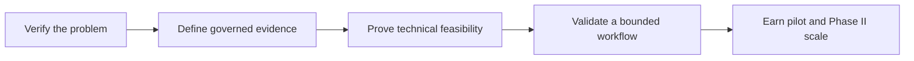

# Programme & Strategy

- [[Research Programme]] — full programme logic, scope, research questions, and delivery path.
- [[03 Research & Evidence/GOALS]] — G1–G14 research goals.
- [[03 Research & Evidence/PLAN]] — execution plan.
- [[03 Research & Evidence/OPERATING_MODEL]] — task packets, loops, quality gates, and escalation.

## Strategic through-line

