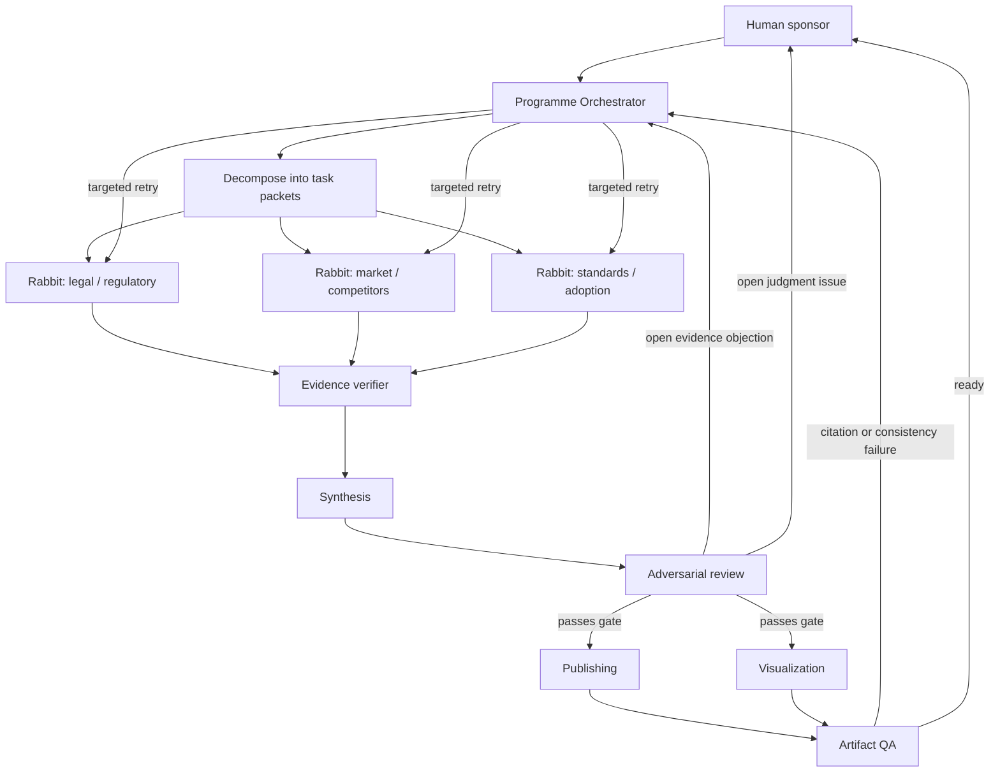

# Agent Operating Model — Freight Trust Research Programme

## Why this revision

The current roster has strong role separation and provenance discipline, but it behaves
mainly as a linear pipeline: Rabbit → Synthesis → Review → Publishing/Visualization.
That leaves three operational gaps:

1. A review objection has no formal return path to the agent that can resolve it.
2. Delegated work has no standard packet containing scope, evidence requirements, budget,
   or exit conditions.
3. Final claims have provenance rules, but the execution path is not recorded: who asked
   for what, which sources were checked, what failed, and why a claim was accepted.

This document is the working control plane for those gaps. It uses loops only where there
is a measurable evaluation criterion and a useful corrective action; it does not turn
every step into an unconstrained autonomous loop.

## Design basis

- **Supervisor/manager delegation:** one coordinator decomposes work, assigns bounded
  subtasks, aggregates results, and owns the exit decision. See [OpenAI's practical guide
  to building agents](https://openai.com/business/guides-and-resources/a-practical-guide-to-building-ai-agents/).
- **Parallel specialist work:** independent evidence threads run concurrently, then a
  synthesis step reconciles them. See [Anthropic's architecture guide](https://resources.anthropic.com/hubfs/Building%20Effective%20AI%20Agents-%20Architecture%20Patterns%20and%20Implementation%20Frameworks.pdf).
- **Evaluator–optimizer iteration:** a generator produces an artifact, an evaluator
  checks it against a rubric, and the generator revises it. This is appropriate for
  research synthesis when the rubric is explicit, not a universal default. See the
  [Anthropic guide](https://resources.anthropic.com/hubfs/Building%20Effective%20AI%20Agents-%20Architecture%20Patterns%20and%20Implementation%20Frameworks.pdf).
- **Evidence-grounded audit trails:** NIST recommends mapping claims and agent actions
  to trusted source material, with probes for faithfulness, completeness, and
  sufficiency. See [NIST's evaluation-probes project](https://www.nist.gov/programs-projects/building-evaluation-probes-agentic-ai).

## Operating topology



The Orchestrator is a role, not necessarily a seventh model. In this workspace it can
be the human operator or the primary Codex session maintaining the task ledger. The
specialists remain responsible for bounded outputs; the Orchestrator owns decomposition,
routing, retries, and stop decisions.

## Task packet: the unit of delegation

Every delegated task should be represented in the working log, even if the log begins
as Markdown rather than a database:

```yaml
task_id: G1-legal-verify-01
parent_id: cycle-2026-08-01
owner: rabbit-legal
objective: Verify the exact holding and limits of the identified court decision.
scope:
  included: [official opinion, docket, reliable case commentary]
  excluded: [general broker-liability predictions]
required_sources: [primary court source]
deliverable: evidence entries with URLs, support, confidence, and conflicts
acceptance_tests:
  - case name, docket, date, holding, and limits are separately supported
  - no conclusion exceeds the source language
  - unresolved facts are explicitly marked
max_attempts: 2
status: queued
```

Minimum fields are: task ID, parent task, owner, objective, scope, required source class,
output artifact, acceptance tests, maximum attempts, and status. A task without an
acceptance test is not ready for delegation.

## Delegation rules

1. **Decompose by uncertainty, not by document section.** Legal holding, implementation
   impact, and commercial implication are different tasks when their sources or failure
   modes differ.
2. **Run independent tasks in parallel.** G1, G2, G3, and independent G4 branches can
   run concurrently when they do not depend on each other's findings.
3. **Keep one writer per artifact.** Specialists may propose changes, but the owner writes
   the canonical artifact after resolving conflicts.
4. **Give review agents a return address.** Each objection names claim IDs, missing
   evidence, a suggested query, and a destination agent.
5. **Do not delegate judgment without a rubric.** Retrieval, extraction, comparison, and
   adversarial questioning can be delegated. Legal characterization, external submission
   readiness, and scope changes require human review.
6. **Prefer one capable agent when a split adds only overhead.** Split when work has
   distinct tools, expertise, source classes, or independent failure modes.

## Loops and gates

### Loop A — Discovery / evidence

Rabbit receives a bounded query, searches, extracts claim-level evidence, and submits
entries. The verifier checks source accessibility, source class, claim-source fit, date,
and conflicts of interest. Repeat only when a required field fails or evidence is below
the required source class. Stop after the acceptance tests pass or maximum attempts are
reached; record `unverified`, `contradicted`, or `blocked` rather than silently upgrading
confidence.

### Loop B — Contradiction

When sources disagree, create a contradiction task containing both sources and the exact
disputed proposition. Rabbit searches for a higher-authority source or an explanation.
Synthesis reports the conflict if it remains unresolved; it must not resolve it by
majority vote.

### Loop C — Synthesis / review

Synthesis drafts against evidence IDs. Review checks claim coverage, citation entailment,
uncertainty labeling, stakeholder balance, and audience requirements. Each failure
becomes a targeted rework packet. Cap at two revision rounds per section, then escalate
to the human owner with the unresolved objection.

### Loop D — Deliverable QA

- every factual sentence has an evidence ID or is clearly labeled as proposal/design;
- every number has a source and date;
- every diagram node and relationship maps to evidence or a briefing section;
- open review objections are not presented as settled facts;
- links work and source metadata is accurate.

New factual claims discovered during production route back to Rabbit; they are not
invented during copy-editing.

### Loop E — Monitoring

At each new research cycle, recheck claims with a freshness window: legal, regulatory,
solicitation, and current market facts. Add a dated amendment or new evidence entry; do
not erase the prior record.

## Exit criteria and escalation

Use explicit statuses: `queued → running → submitted → verified → accepted`.
Alternative terminal states are `unverified`, `contradicted`, `blocked`, and `rejected`.

Escalate when the primary source cannot be found after maximum attempts; sources conflict
on a claim that changes legal, funding, or safety framing; the task requires outreach,
confidential data, legal advice, or a scope decision; another loop has lower decision value
than its cost; or a high-severity objection would otherwise ship.

The system is complete when every load-bearing claim has an accepted or explicit
unresolved status, all high-severity findings are closed or escalated, and deliverable QA
passes. “More sources exist” is not by itself a reason to continue.

## Minimal observability record

Add `research/run-log.md` in the next implementation pass. Each row should capture:

| Field | Purpose |
|---|---|
| run/task ID | Reconstruct the execution path |
| parent and owner | Show delegation and accountability |
| input artifact/version | Prevent stale-context errors |
| queries/tools used | Make discovery reproducible |
| sources added/rejected | Show evidence selection |
| reviewer verdict | Record the gate result |
| retry count and reason | Detect non-converging loops |
| final status and timestamp | Support freshness and auditability |

## Evaluation metrics for the next cycle

1. **Claim coverage:** load-bearing claims with an evidence ID / total load-bearing
   claims.
2. **Citation entailment pass rate:** citations that actually support their claims.
3. **Source quality mix:** primary, secondary, and unverified entries by goal.
4. **Review escape rate:** high-severity findings discovered after publication QA.
5. **Loop convergence:** median revision rounds and percentage of tasks accepted without
   escalation.
6. **Delegation efficiency:** duplicate tasks, stale-input retries, and cost per accepted
   claim.

## Immediate implementation

1. Add stable claim IDs (`G1-C01`, etc.) to `research/evidence.md`.
2. Add `research/run-log.md` and one task packet per open goal in `research/PLAN.md`.
3. Split Rabbit only for independent source classes; keep one Orchestrator responsible
   for routing and acceptance.
4. Add an evidence-verification gate before Synthesis.
5. Convert Review objections into targeted re-search tasks, with a two-round cap and
   human escalation.
6. Let Publishing and Visualization work in parallel only after the relevant briefing
   section passes review.

