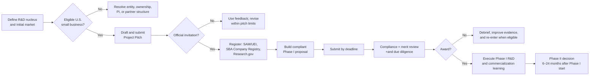

# NSF SBIR/STTR Process & Readiness Guide

*Working guide for the Freight Trust programme — current as of 1 August 2026. This is a practical planning document, not legal, tax, or grant-administration advice. Confirm the solicitation, PAPPG, and Research.gov instructions in effect on the day of submission.*

## Executive decision

NSF SBIR/STTR is a credible funding route for the programme **if the company is building a technically novel, high-risk R&D product**, rather than proposing a consulting study, policy advocacy, or ordinary software integration. The fundable core is an evidence-preserving, privacy-aware system for freight identity, facility-event verification, entity resolution, and contestable decisions.

Phase I is not entered through a full proposal alone. The company must first submit an NSF **Project Pitch** and receive an official invitation. An invitation is valid for the next two full-proposal deadlines — this mechanism is corroborated across multiple sources, but a 2026-08-01 evidence-refresh pass could not locate the literal current-cycle sentence on a direct fetch of the live seedfund.nsf.gov pages (only a worked example); **re-confirm the exact current wording on the live page at submission time** before relying on it for scheduling. The current Phase I deadlines are **4 November 2026, 4 March 2027, and 7 July 2027**, by 5:00 p.m. in the submitting organization’s local time. NSF says a Project Pitch response typically takes one to two months. Therefore, unless the company already holds a valid invitation, **4 March 2027 is the prudent planning target**; an earlier submission is possible only if the invitation arrives in time and the proposal is genuinely ready.

NSF 26-510 permits a Phase I request of up to **$305,000** for **6–18 months** of R&D, a figure that "encompasses all direct and indirect costs as well as the small business fee, Technical and Business Assistance (TABA), and the optional... Innovation Corps (I-Corps)" — i.e., TABA (up to $6,500 for Phase I) and I-Corps are funded *inside* the $305,000 cap, not requested as additive amounts. It is a competitive research award, not a procurement contract, and NSF takes no equity. Phase I must prove technical feasibility and reduce the highest technical/commercial risks; it should not promise a complete nationwide deployment.

**Schedule context: the 2025–2026 reauthorization lapse.** SBIR/STTR authorization nationally lapsed from 2025-09-30 to 2026-04-13 — the longest lapse in the programs' 42-year history — during which NSF and ten other agencies could not open new Phase I/II competitions. The *Small Business Innovation and Economic Security Act of 2026* (S. 3971) reauthorized the programs through 2031-09-30, and NSF Project Pitches reopened 2026-06-02. This explains why this guide's planning horizon starts where it does, and corroborates rather than contradicts the dates above; confirm the bill number/date via congress.gov if this history is ever cited directly in a proposal (secondary trade-press confidence only as of this guide's last update).

## The route from concept to award

## 1. Choose the right lane: SBIR or STTR

| Question | SBIR | STTR | Recommended default for Freight Trust |
|---|---|---|---|
| Is a nonprofit research institution required? | No; external partners are allowed but optional. | Yes. | **SBIR**, unless a university/nonprofit laboratory must perform core research. |
| Minimum small-business R&D share | At least two-thirds of the budget. | At least 40% of the budget. | SBIR preserves more product-building capacity inside the company. |
| Research-institution share | No required share. | At least 30%; it must receive a subaward. | Use STTR only with a specific, essential research role and negotiated IP/data rights. |
| Leadership | One company PI; no co-PIs. | Company PI plus one research-institution co-PI. | SBIR is operationally simpler. |

Do not select STTR merely because an academic advisor, evaluator, or pilot partner is helpful. Select it when an eligible research institution is indispensable to the R&D and can commit a qualified co-PI, a scope of work, and an IP/data arrangement.

## 2. Eligibility gate: resolve before writing at length

| Gate | What must be true | Owner | Evidence to collect now |
|---|---|---|---|
| Small business | Fewer than 500 employees, including affiliates; meets applicable U.S. small-business ownership/control requirements. | CEO + counsel | Cap table, affiliate map, incorporation records. |
| Domestic R&D | Funded R&D occurs in the United States; funded personnel have a legal right to work in the U.S. | PI + operations | Work-location and personnel plan. |
| PI | At award and throughout performance, the PI is at least 51% employed by the small business. NSF normally treats outside work above 19.6 hours/week as conflicting. The PI needs U.S. work authorization, but no specific degree. | Proposed PI | Employment/effort plan and résumé. |
| Research security | Key personnel must satisfy current NSF research-security and certification requirements. | PI + counsel | Conflict, affiliations, appointments, and funding review. |
| Submission capacity | Only one Phase I/Fast-Track project can be under consideration for the company at a time; there are limits on Project Pitch and proposal submissions. | Grant lead | Submission log. |
| STTR only | Named eligible nonprofit research institution, company PI, research-institution co-PI, subaward, and required budget split. | PI + partner lead | Letter of commitment, scope, budget, IP/data terms. |

**Hard stop:** do not represent an individual as PI until the company can actually meet the employment rule at award. Do not use another organization’s name, facilities, or pilot data without a documented authorization.

## 3. Project Pitch: the required first submission

The Project Pitch is a concise screening submission. It is not a mini business plan. NSF wants the technically unproven R&D and why it could create a consequential product, not a description of standard application features.

| Required field | NSF limit | What reviewers need to understand | Freight Trust draft direction |
|---|---:|---|---|
| Technology innovation | 3,500 characters | The scientific/engineering innovation and why existing methods are inadequate. | Federated, provenance-preserving evidence graph that resolves freight identities and verifies facility events while retaining uncertainty, policy constraints, and an appeal path. |
| Technical objectives and challenges | 3,500 characters | The unknowns, hypotheses, measurable objectives, and main technical risks. | Test entity-resolution accuracy and calibration under sparse/conflicting records; test event provenance and tamper resistance; test privacy-preserving federation; measure error disparity and correction latency. |
| Market opportunity | 1,750 characters | First buyer, unmet pain, alternatives, market significance, and route to validation. | Start with a narrow buyer/beneficiary pairing such as broker/carrier networks and shipper/facility partners handling onboarding, fraud, and disputed events. Validate this beachhead before submission. |
| Company and team | 1,750 characters | Why the proposed company and people can execute the R&D and commercialize it. | Name only actual team members; identify PI, freight-domain expertise, data/security expertise, product ownership, and any committed research/pilot partners. Do not invent credentials or relationships. |

### Working Project Pitch outline

Use this as a drafting scaffold. Replace brackets and validate every claim before submission.

**Technology innovation.** The proposed technology is a federated evidence graph for explainable freight identity and facility-event verification. Freight transactions depend on fragmented records across carriers, brokers, facilities, insurers, telematics providers, and public registrations. Existing onboarding and risk tools often produce a binary score or opaque alert; they do not reliably represent source provenance, uncertainty, permitted use, or a mechanism for a party to contest and correct a decision. The research will create [specific technical method] combining calibrated entity resolution, signed/provenanced event assertions, and policy-enforced data federation. The innovation is not a new dashboard: it is a decision substrate that can abstain when evidence is insufficient, preserve the reason for a conclusion, and support correction without exposing unrelated commercial data.

**Technical objectives and challenges.** Phase I will determine whether the system can: (1) resolve entities across incomplete and conflicting freight records with calibrated uncertainty; (2) link facility-event claims to independently assessable provenance while detecting tampering or contradictions; (3) enforce purpose- and partner-specific data-sharing policy across a federated graph; and (4) provide contestable outputs that reduce harmful false positives across relevant carrier segments. Key risks include missing ground truth, adversarial records, partner data heterogeneity, privacy constraints, and the trade-off between fraud detection and equitable treatment. Success metrics will include precision/recall and calibration against a held-out benchmark, provenance-coverage and tamper-detection measures, policy-enforcement tests, disparity/error analyses, and correction-time targets.

**Market opportunity.** The initial customer hypothesis is [specific buyer] that currently bears cost and risk from [specific workflow, e.g., onboarding / identity verification / disputed facility events]. The initial user/beneficiary is [carrier, broker, shipper, facility, insurer]. Alternatives include manual checks, point data providers, credit/fraud tools, and internal rules engines. The product’s commercial value depends on reducing avoidable verification labor and costly bad decisions while producing defensible evidence for audit and dispute handling. Before submission, validate the beachhead with at least [five to ten] structured discovery interviews and [two] written pilot-interest statements.

**Company and team.** [Company] is a U.S. small business developing [product]. [PI name] will lead the R&D and meet the required employment commitment at award. [Name/role] leads [security/data/ML], and [name/role] leads [freight commercial/product]. [Named partner] contributes [defined capability] under [SBIR consultant/subaward or STTR partner] terms. The team has direct access to [lawfully obtainable data, pilot environment, or test infrastructure]. The Phase I work will establish the technical and market evidence required to pursue [commercial route].

## 4. Preparation sequence and decision timeline

| When | Decision or deliverable | Definition of done |
|---|---|---|
| Weeks 0–2 | Confirm applicant structure and PI | Eligibility owner signs off on company, ownership, PI employment path, work authorization, and research-security review. |
| Weeks 0–3 | Select SBIR or STTR | One-page decision memo; if STTR, partner scope, co-PI, subaward, and IP/data terms are real—not aspirational. |
| Weeks 1–4 | Narrow the R&D nucleus | Three or four testable technical aims, baselines, datasets/permissions, risks, and numerical success thresholds. |
| Weeks 2–5 | Customer discovery | Interview log, buyer segmentation, quantified pain hypotheses, alternatives, and signed/credible pilot-interest evidence. |
| Weeks 3–5 | Submit Project Pitch | Four complete fields, reviewed for R&D specificity, market clarity, and factual accuracy. |
| While invitation is pending | Build proposal materials | Begin registrations, budget assumptions, bios, data-management decision, partner letters, technical plan, and commercialization evidence. |
| On invitation | Schedule proposal lock | Confirm invitation expiry date; select the earliest deadline that permits quality and compliance. |
| 6–8 weeks before due date | Proposal draft complete | Every required Research.gov document exists; independent reviewer can trace claims to evidence. |
| 2–3 weeks before due date | Compliance lock | Registrations match exactly; budget allocation, letters, PDFs, and supplementary documents are final; leave time for system and organizational approvals. |

### Practical deadline choice

- **Submit for 4 November 2026** only if a valid Project Pitch invitation already exists or arrives promptly, registrations are underway, the PI/ownership gates are settled, and the company can submit a fully reviewed technical plan.
- **Plan for 4 March 2027** if the Project Pitch is being initiated now. This is the realistic base case given NSF’s stated one-to-two-month response window and the work required for a strong proposal.
- **Use 7 July 2027 as a quality buffer** if pilot/data access, PI structure, or a research partnership is unresolved. A rushed compliant proposal is not a strategy.

These dates are from the current solicitation; NSF directs proposers to use the instructions in effect at the applicable deadline.

## 5. Full Phase I proposal: build around proof, not aspiration

NSF requires the full proposal through Research.gov, after an invitation. The exact portal fields and current PAPPG controls must be checked during submission. The core package includes the standard cover and certifications, project summary, project description, references, budget and justification, facilities/resources, senior/key-personnel materials, data-management plan, letters and supplementary documents where applicable, and the Project Pitch invitation as a single-copy document.

### Recommended project-description spine

| Section | The question it must answer | Freight Trust evidence to prepare |
|---|---|---|
| Problem and significance | Why is this problem economically and technically important? | Source-backed cost/risk narrative; concrete workflow and failure modes; focus on verifiable claims. |
| Innovation | What is technically new beyond an ordinary software integration or rules engine? | Architecture diagram; prior-art comparison; why provenance + calibrated uncertainty + policy enforcement must work together. |
| Aim 1: identity resolution | Can the system correctly reconcile fragmented identities while knowing when not to decide? | Benchmark design, baselines, data provenance, precision/recall/calibration targets, error analysis. |
| Aim 2: event provenance | Can a facility event be represented, verified, and challenged with defensible source lineage? | Event schema, trust assumptions, tamper/contradiction tests, correction workflow. |
| Aim 3: governed federation | Can partners share only permitted evidence and retain contestability? | Policy model, access tests, audit logs, redress prototype, privacy/security threat model. |
| Integration and pilot | Will the components work in a real bounded workflow? | Named workflow, nonbinding pilot letters, deployment assumptions, measurable operational outcome. |
| Commercialization | Who pays, why now, and why this company? | Segmented buyer map, interview evidence, competitors/alternatives, pricing hypothesis, route to market. |
| Team and resources | Can this team conduct the proposed R&D? | True biographies, role/effort table, partner commitments, facilities and data access. |
| Broader impacts | What societal benefits are designed into the work and how will they be assessed? | Small-carrier access, correction rights, error-disparity measures, data-minimization and accountability plan. |

### Suggested Phase I technical milestones

| Milestone | Illustrative quantitative criterion | Why it matters |
|---|---|---|
| Provenance schema and threat model | Every decision-relevant assertion records source, time, permitted use, confidence, and correction status in the test corpus. | Prevents an opaque score from becoming the product. |
| Entity-resolution feasibility | Beat a defined baseline on a held-out, permissioned test set; report calibration and segment-level error, not only aggregate accuracy. | Tests whether the claimed innovation adds value. |
| Event-verification feasibility | Detect defined simulated contradiction/tampering cases and preserve an auditable evidence trail. | Tests whether facility claims are meaningfully defensible. |
| Federation policy enforcement | Demonstrate that disallowed partner/field/purpose combinations are denied and audited in automated tests. | Tests privacy and commercial-boundary claims. |
| Redress workflow | In a scripted challenge case, correct or annotate a record and show that downstream decision context changes within a defined target time. | Makes contestability measurable. |
| Commercial evidence | Complete structured interviews and obtain credible, nonbinding pilot-interest documentation from target participants. | Tests the beachhead, not just technical elegance. |

Set the actual thresholds after the company identifies lawful datasets and baselines. Never choose a metric that cannot be measured with accessible, permissioned data.

## 6. Review rubric translated for this programme

NSF evaluates **Intellectual Merit, Broader Impacts, and Commercial Potential**. The proposal should make it easy for a reviewer to find a direct answer to each.

| Criterion | Review question | What a persuasive Freight Trust proposal shows |
|---|---|---|
| Intellectual Merit | Is the proposed work novel, rigorous, feasible, and consequential? | A genuinely uncertain technical hypothesis; rigorous comparative evaluation; known failure modes; credible team and resources. |
| Broader Impacts | Can the work benefit society or advance desired outcomes? | Safer and more reliable freight transactions, explicit small-carrier safeguards, minimal data use, transparent errors, and measured redress—not generic claims. |
| Commercial Potential | Is there a significant market and durable path to value? | A focused beachhead, customer discovery, costed workflow pain, differentiation from existing data/verification tools, a buyer and business model, and a credible next financing/partner path. |

### Common failure patterns to avoid

- Presenting a policy report, marketplace, dashboard, or data integration as R&D without a falsifiable engineering unknown.
- Claiming proprietary datasets or partnerships that are not yet authorized in writing.
- Treating “AI” as the innovation without specifying model inputs, uncertainty, baselines, failure modes, and evaluation.
- Equating an aggregate accuracy result with safety or fairness; report uncertainty and relevant segment-level errors.
- Writing an enormous market narrative without identifying the first buyer, workflow, integration path, and commercial alternative.
- Ignoring data rights, correction, and security until after the pilot.
- Adding voluntary cost sharing. NSF states voluntary committed cost sharing is prohibited for this solicitation.

## 7. Registrations, documents, and operating controls

### Start registrations as soon as the entity path is confirmed

For a full proposal, NSF identifies three core registrations: **SAM.gov with a UEI**, **Research.gov**, and **SBA Company Registry**. The company’s legal name, physical address, UEI, and other identifiers must be consistent across systems. Registration is not required to submit a Project Pitch, but it is a predictable source of delay once invited.

### Proposal-control checklist

- [ ] Company eligibility and ownership/affiliate analysis complete.
- [ ] PI employment and effort plan signed by company leadership.
- [ ] SBIR/STTR decision memo complete; any research-partner terms documented.
- [ ] Project Pitch invitation saved; its two-deadline validity window recorded — re-confirm the exact current wording of this mechanic on the live seedfund.nsf.gov page at submission time rather than relying solely on this guide.
- [ ] Technical and Business Assistance (TABA) budgeted as its own line item **inside** the $305,000 total (up to $6,500 for Phase I), not requested as a separate post-award supplement (contrast with the older two-step model in NSF's archived `nsf20-070` guidance).
- [ ] SAM/UEI, SBA Company Registry, and Research.gov records active and internally consistent.
- [ ] Technical work plan states hypotheses, baselines, datasets, permissions, risks, milestones, and go/no-go criteria.
- [ ] Budget reflects the selected programme’s allocation rule and allowable work; no voluntary committed cost sharing.
- [ ] Data-management plan deliberately addresses proprietary data, sharing limits, retention, access, and provenance. Do not use a blanket proprietary-data designation if it conflicts with the project’s proposed validation or partner commitments.
- [ ] Letters are from actual external parties and state a specific contribution or interest; they do not substitute for required evidence.
- [ ] Bio, current/pending-support, conflict, facilities, and certification materials are checked against the current instructions.
- [ ] Proposal is independently reviewed for unsupported claims, compliance, and reviewer readability before portal submission.

## 8. What can be done now, before an invitation

1. **Name the applicant and PI.** This is the gating decision, not administrative cleanup.
2. **Choose the beachhead.** Pick one initial, testable workflow—for example, onboarding verification or disputed facility-event evidence—rather than attempting all freight trust problems at once.
3. **Secure lawful evaluation inputs.** Document what data can be used, who may authorize it, what labels/ground truth exist, what cannot leave a partner’s environment, and what must be deleted or retained.
4. **Write the benchmark protocol.** Define baselines, sample construction, success thresholds, error slices, abstention logic, correction protocol, and reproducibility/audit artifacts.
5. **Run structured customer discovery.** Record interviews rather than relying on anecdotal enthusiasm. Capture buyer role, current process, cost/risk, alternative, willingness to pilot, data constraints, and procurement blockers.
6. **Get specific pilot-interest letters.** Seek commitments to a bounded validation environment, not vague endorsements. Keep them nonbinding unless counsel approves otherwise.
7. **Create a technical risk register.** Include data sparsity, adversarial manipulation, cross-party identity error, privacy leakage, bias/disparate impact, integration, and adoption risk—with a Phase I experiment attached to each material risk.
8. **Submit a focused Project Pitch.** Treat feedback or a non-invitation as information: revise the R&D story and customer framing within NSF’s submission limits.

## 9. Immediate deliverables for the programme

| Deliverable | Why it exists | Suggested accountable owner |
|---|---|---|
| SBIR eligibility memo | Establishes the company/PI/ownership lane. | CEO + counsel |
| R&D hypothesis and benchmark brief | Converts the broad programme into fundable Phase I experiments. | PI + technical lead |
| Data-rights and partner map | Prevents unsupported claims and unusable test data. | Product/data lead + counsel |
| Customer-discovery evidence pack | Grounds commercial potential in observed demand. | Commercial lead |
| Project Pitch draft | Obtains the required invitation. | PI + grant lead |
| Phase I proposal production plan | Assigns each required document, review, and deadline. | Grant lead |

## Official sources and verification links

- [NSF 26-510: current SBIR/STTR solicitation](https://www.nsf.gov/funding/opportunities/small-business-innovation-research-small-business-technology/nsf26-510/solicitation) — deadlines, award parameters, PI requirement, programme rules, and current controlling solicitation.
- [NSF Project Pitch](https://seedfund.nsf.gov/project-pitch/) — required initial screening route and four-field Pitch process.
- [NSF SBIR/STTR eligibility and requirements](https://seedfund.nsf.gov/solicitation-eligibility/) — ownership, personnel, registration, and SBIR/STTR allocation requirements.
- [NSF Phase I proposal contents and preparation](https://seedfund.nsf.gov/solicitation-proposal/) — Research.gov submission components and proposal-specific instructions.
- [NSF merit review criteria and process](https://seedfund.nsf.gov/solicitation-merit-review/) — Intellectual Merit, Broader Impacts, Commercial Potential, compliance, and due diligence.
- [NSF Proposal & Award Policies & Procedures Guide](https://www.nsf.gov/policies/pappg) — use the version in effect on the selected deadline.

## Relationship to the broader research programme

This guide operationalizes Goal G3 in the project’s research plan. The supporting problem evidence, stakeholder landscape, governance concepts, and technical workstreams are consolidated in the [[01 Client Briefs/Freight Trust Client Master Brief]]. This SBIR guide deliberately narrows that broader programme into a Phase I-sized R&D case: prove a technically distinct, measurable capability in a bounded workflow, then use results and partner evidence to justify a Phase II-scale product path.
