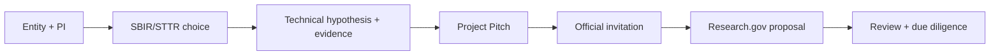

# NSF SBIR/STTR

- [[NSF SBIR STTR Process and Readiness Guide]] — current process, eligibility gate, Project Pitch scaffold, proposal plan, and official sources.
- [[01 Client Briefs/Freight Trust Client Master Brief#7. NSF SBIR/STTR readiness]] — funding case within the wider programme.
- [[03 Research & Evidence/GOALS#G3 — Identify a legitimate SBIR path and template]] — source research goal.

## Folder structure

This section holds three kinds of material, now separated into subfolders so drafts, reference guides, and QA output don't sit flat in one pile:

- **04 SBIR/** (this level) — stable reference material: this MOC, the readiness guide, and the evidence refresh.
- **[[04 SBIR/Drafts/|04 SBIR/Drafts/]]** — the six working proposal documents (Pitch, Project Description, Budget, DMP, Commercialization Plan, Risk Register).
- **04 SBIR/Review/** — independent review output (Proposal Review Notes).

## Proposal package (drafts, 2026-08-01)

- [[Project Pitch Draft]] — the four NSF Pitch fields, character-checked, with a facts-required checklist.
- [[Phase I Project Description Draft]] — full technical narrative: aims 1–3, work plan, milestones, broader impacts, Phase II trajectory.
- [[Phase I Budget and Justification Draft]] — $305K/12-month skeleton with the ≥2/3 small-business share check.
- [[Data Management Plan Draft]] — field-level data classes, provenance, retention, sharing, and redress records.
- [[Commercialization Plan Draft]] — beachhead buyer hypothesis, alternatives, business model, evidence still required.
- [[Technical Risk Register]] — material risks mapped to Phase I experiments and go/no-go milestones.

## Evidence and review

- [[SBIR Evidence Refresh]] — 2026-08-01 verification of solicitation facts plus current market/fraud evidence.
- [[Proposal Review Notes]] — independent review findings across the package (now in 04 SBIR/Review/).
- [[03 Research & Evidence/Dataset Scan - Entity Resolution]] / [[03 Research & Evidence/Dataset Scan - Event Provenance and Federation]] — real datasets and tooling for synthetic Phase I benchmark experiments (Aims 1–3); findings are incorporated into the Project Description.

Supporting visuals: [[07 Visuals/Visual Index#Phase I technical architecture|Phase I technical architecture]], Phase I work plan, and the SBIR submission map (diagrams 06–08).

## Phase I readiness sequence

## Immediate decisions

- [ ] Confirm small-business eligibility, ownership, and affiliate status.
- [ ] Confirm a PI who can meet NSF employment requirements at award.
- [ ] Select a narrow buyer/workflow and a measurable R&D hypothesis.
- [ ] Confirm data rights and pilot partners.
- [ ] Draft and submit the Project Pitch.

