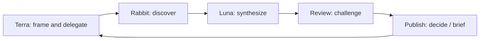

# Agent System

## Control plane

- [[FRAMEWORK]] — Terra orchestration, Luna synthesis, Rabbit discovery, loops, and stop conditions.
- [[ROSTER]] — roles and handoffs.
- [[MCP_CAPABILITIES]] — tool and connector boundaries.
- [[TOOLS_AND_SKILLS]] — current tool/skill roster.

## Role notes

- [[01-rabbit-agent]] — wide-net discovery.
- [[02-synthesis-agent]] — evidence synthesis.
- [[03-review-agent]] — challenge and quality control.
- [[04-publishing-agent]] — human-readable output.
- [[05-visualization-agent]] — diagrams and visual brief support.

## Reusable research skill

- [[05 Agent System/skills/freight-trust-research/SKILL]]
- [[05 Agent System/skills/freight-trust-research/references/artifact-contracts]]
- [[05 Agent System/skills/freight-trust-research/references/source-policy]]

## Operating loop

