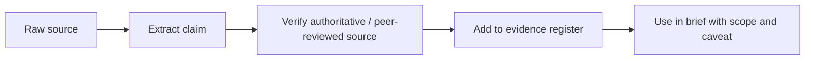

# Source Materials

This area preserves requests, notes, copied reports, and planning inputs. It is an intake/provenance layer, not automatically validated evidence.

## High-priority inputs

- [[ellieconvo]] — client request; read before creating external deliverables.
- [[evan-on-freight-trust]] — stakeholder and opportunity notes.
- [[okn-pilot-trust-infrastructure]] — Open Knowledge Network pilot concept.
- [[trust-notes]] — raw conceptual notes.
- [[agent-framework-plan]] — original agent-framework planning record.

## Long-form reference material

- [[atri-operational-costs-of-trucking-2026]]
- [[cross-actor-orchestration-app-planning]]
- [[originals/AGENT_framework_plan]]
- [[originals/ellieconvo]]
- [[originals/trust]]

## Promotion path

