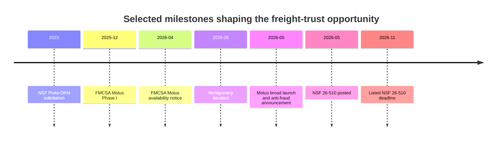
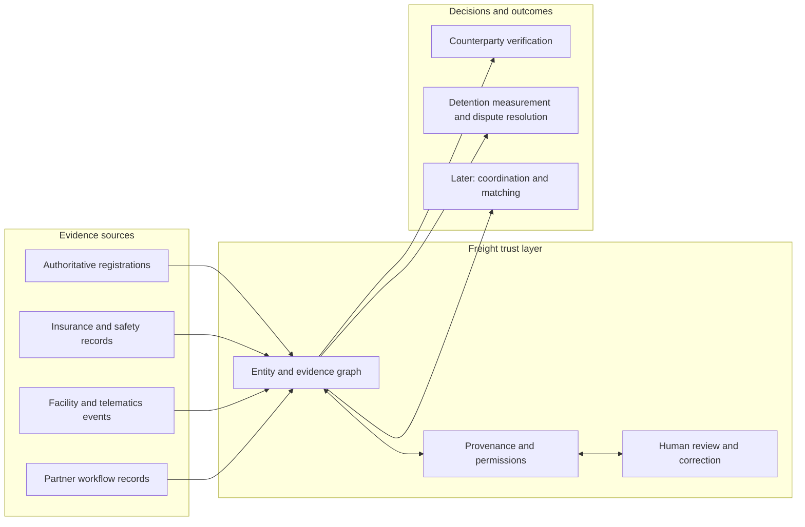
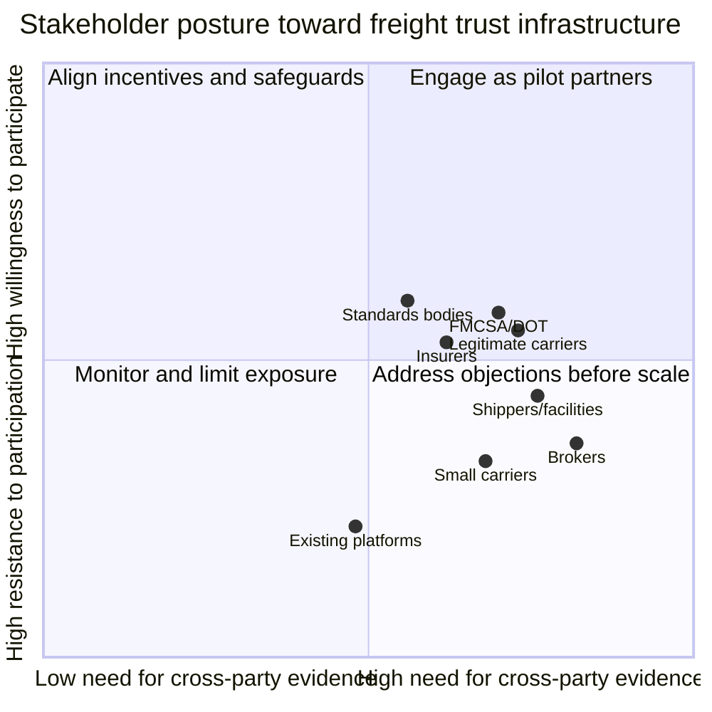
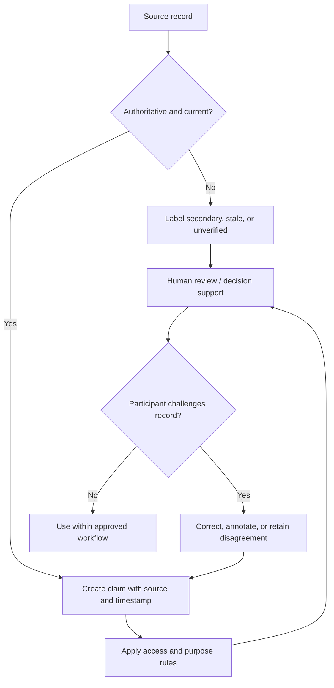
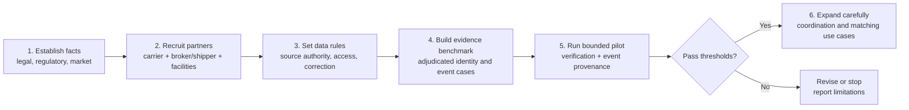

# Freight Trust Infrastructure

## Client Master Brief: landscape, pilot strategy, and NSF SBIR readiness

**Prepared for:** Client, prospective partners, and funders  
**Status:** Preliminary research programme — designed for evidence-led validation

## Executive summary

Freight logistics lacks a shared, trusted record of who counterparties are, what evidence
supports their credentials, and when consequential operating events occurred. This creates
friction in carrier verification, disputes over detention, fragmented oversight, and weak
cross-party coordination.

The proposed programme will test a **federated freight trust layer**: an evidence and
event-provenance system that links authoritative source records while allowing participants
to retain control over their raw commercial data. Its first purpose is to improve
verification quality, operating-event visibility, and dispute resolution. It is not a
universal risk score, legal standard, or claim of automatic fraud/detention/empty-mile
reduction.

The recommended immediate step is a narrow, governed pilot involving one carrier cohort,
one broker or shipper cohort, and one or two facilities. The pilot should measure whether
the approach improves evidence quality and participant outcomes before it expands into
coordination or load-matching use cases.

## The client questions this programme answers

| Client question | Answer in this brief |
|---|---|
| What is happening in freight trust and verification? | The landscape includes a material detention problem, continuing identity-verification challenges, FMCSA registration modernization, and an unsettled but more consequential broker-liability environment. |
| Who matters, and who will resist? | Regulators, brokers, carriers, shippers/facilities, insurers, platforms, associations, standards bodies, and transportation lawyers each have distinct incentives and concerns. |
| Is there an NSF SBIR angle? | Yes: a research programme on federated evidence graphs for explainable freight identity and facility-event verification, with measurable technical and adoption hypotheses. |
| What should happen first? | Establish facts, secure pilot partners, define data/governance rules, build an adjudicated benchmark, and run a limited evaluation. |

## 1. Why now

### Operating visibility and detention

ATRI's 2023 analysis estimated that 39.3% of stops involved detention, resulting in 135.9
million lost hours, $3.6 billion in direct expenses, and $11.5 billion in productivity
losses for for-hire trucking. These are industry estimates, not a federal census, but they
establish a significant measurement and coordination problem. [ATRI study record](https://trid.trb.org/View/2427471)

FMCSA continues to research how detention can be measured and separated from ordinary dwell
time. [FMCSA detention research](https://www.fmcsa.dot.gov/research-and-analysis/impact-driver-detention-time-safety-and-operations)

### Identity, fraud, and oversight

GAO documented historical coverage and resource constraints in FMCSA efforts to identify
freight carriers that may evade detection through changed identities. [GAO-12-364](https://www.gao.gov/products/gao-12-364)

FMCSA's Motus registration system was introduced in phases and broadly launched in May
2026. FMCSA describes it as a modernization and anti-fraud initiative with enhanced
verification tools. It is relevant evidence that identity assurance is a current public
infrastructure priority, not evidence that a private system should replace official records.
[Motus notice](https://www.fmcsa.dot.gov/regulations/federal-register-documents/2026-08334), [launch announcement](https://www.fmcsa.dot.gov/newsroom/trumps-transportation-secretary-sean-p-duffy-launches-new-anti-fraud-registration-system)

### Legal context

In *Montgomery v. Caribe Transport II, LLC* (May 14, 2026), the Supreme Court held that the
FAAAA does not preempt state-law negligent-selection claims against brokers under the safety
exception. The ruling does not define a universal standard of reasonable carrier-selection
care. The programme should therefore support evidence quality and human workflow, not
represent itself as a legal safe harbor. [Cornell LII opinion](https://www.law.cornell.edu/supremecourt/text/24-1238)

Editable source: [visuals/05-regulatory-timeline.mmd](../visuals/05-regulatory-timeline.mmd).

## 2. The proposed freight trust layer

The programme has three connected components.

| Component | What it does | Early client value |
|---|---|---|
| Carrier evidence graph | Links identity, registration, insurance, safety, and relationship evidence with source, date, confidence, access, and correction metadata. | Faster and more explainable verification. |
| Facility-event provenance | Captures permissioned appointment, arrival, gate, dock, loading/unloading, and departure events. | Better detention measurement and dispute resolution. |
| Governance and participation layer | Manages access, purpose limits, correction rights, data quality, and reciprocal incentives. | Participation without unnecessary disclosure of commercial data. |

The architecture is federated by default: source systems remain authoritative; the trust
layer establishes what evidence exists, where it came from, and how it may be used.

## 3. Stakeholder landscape and pushback

| Stakeholder | Value proposition | Likely pushback | Required response |
|---|---|---|---|
| FMCSA / DOT | More reliable, traceable evidence for registration-related workflows. | Any claim of delegated public authority. | Align to official records; do not replace them. |
| Brokers | Better due-diligence evidence and faster onboarding. | Increased liability or data obligations. | Human review, source limitations, and minimum disclosure. |
| Legitimate carriers | Fairer verification and protection from impersonation. | False positives and opaque scoring. | Correction, appeal, low-friction onboarding, no score-only decisions. |
| Small carriers | Basic verification access and transaction transparency. | Cost, staff burden, paywalls, exclusion. | Segment impact by fleet size; avoid new manual entry. |
| Shippers and facilities | Better reliability and event visibility. | Disclosure of commercial performance. | Permissioned events and clear purpose limits. |
| Insurers | Better-supported evidence and auditability. | Data quality and claims implications. | Provenance, confidence, and clear limitations. |
| Existing platforms | Interoperable evidence rails that can complement workflows. | Data moat erosion or disintermediation. | Open interfaces; avoid forced replacement. |
| Associations / standards bodies | Member value and interoperable practice. | Premature standards or policy claims. | Align to ASTM/NMFTA and engage on evidence. |
| Transportation lawyers | Better factual records and clear limitations. | Overstatement of legal significance. | Legal review and non-reliance language. |

This is a working engagement map, not a survey result. Editable source:
[visuals/02-stakeholder-pushback-map.mmd](../visuals/02-stakeholder-pushback-map.mmd).

## 4. Market, standards, and technical rationale

The market already includes products for verification, visibility, telematics, load
matching, and freight data. The proposed distinction is an explainable, cross-party
evidence and provenance layer rather than another closed risk score or visibility portal.

| Existing category | Programme position |
|---|---|
| Carrier/broker verification | Complement proprietary scores with attributable, challengeable evidence. |
| Visibility and telematics | Reuse available operating events; establish common provenance rather than replace devices. |
| Load matching and market data | Treat as a later application after evidence quality and adoption are proven. |
| Standards and APIs | Align with relevant ASTM F49 terminology and NMFTA freight interfaces where applicable. |

Peer-reviewed research supports knowledge graphs for representing multi-hop supply-chain
relationships and federated graph learning for privacy-preserving analysis. It makes the
technical direction credible; it does not prove freight-pilot outcomes. [Knowledge-graph research](https://doi.org/10.1080/00207543.2022.2100841), [federated-learning research](https://doi.org/10.1016/j.asoc.2024.112475)

NIST's traceability meta-framework supports the design principle that traceability requires
trusted repositories, linked records, secure access, and event recording—not merely a
graph database. [NIST IR 8536](https://csrc.nist.gov/pubs/ir/8536/ipd)

## 5. Research goals and client deliverables

| Workstream | Goals | Client deliverable |
|---|---|---|
| Legal, regulatory, and funding readiness | G1–G3 | Source-backed legal/regulatory timeline and current NSF funding-readiness brief. |
| Market, standards, and stakeholder alignment | G4–G6 | Competitive landscape, CAVRA assessment, and stakeholder/standards map. |
| Adoption, equity, and partner discovery | G7–G9 | Data-sharing incentive model, small-carrier impact assessment, and interview synthesis/plan. |
| Pilot, governance, and technical validity | G10–G14 | Hypotheses, minimum architecture, participation test, redress policy, and evidence benchmark. |

The programme will judge progress by predeclared measures rather than a broad promise of
transformation.

| Hypothesis | Measurement approach | Failure condition |
|---|---|---|
| Evidence graph improves verification | Resolution time, precision/recall, abstention rate. | No improvement over current workflow at comparable error cost. |
| Provenance improves detention measurement | Timestamp coverage, ground-truth agreement, dispute time. | Event data is too incomplete or biased. |
| Federation improves participation | Uptake, retention, requested fields, rejection reasons. | No material adoption or trust advantage. |
| Reciprocal value sustains sharing | Uptake under different offers; net benefit by segment. | Participation remains low after a concrete benefit. |
| Design protects small carriers | Burden, false positives, appeals, onboarding by fleet size. | Materially worse outcomes without mitigation. |

## 6. Governance and redress

The programme must include independent governance, transparent funding, role-based access,
purpose limitation, data minimization, correction and appeal, published quality rules,
meaningful abstention, and human review for any consequential decision. Basic verification
access should not become a pay-to-participate barrier for small carriers.

The Global Legal Entity Identifier System is a useful analogue for standardized identity
data, quality controls, and correction processes; it is not a freight solution.
[GLEIF](https://www.gleif.org/en)

Editable source: [visuals/04-evidence-governance-loop.mmd](../visuals/04-evidence-governance-loop.mmd).

## 7. NSF SBIR/STTR readiness

NSF 26-510 is the current SBIR/STTR solicitation. It emphasizes Intellectual Merit,
Broader Impacts, and Commercial Potential. Phase I applicants must first receive an
official invitation after a Project Pitch. The solicitation lists November 4, 2026 as the
next full-proposal deadline; recheck the solicitation and current PAPPG immediately before
submission. [NSF 26-510](https://www.nsf.gov/funding/opportunities/small-business-innovation-research-small-business-technology/nsf26-510/solicitation)

For the actionable eligibility, Project Pitch, proposal-production, and March 2027 planning
path, see the [NSF SBIR/STTR Process & Readiness Guide](NSF_SBIR_STTR_PROCESS_AND_READINESS_GUIDE.md).

### Recommended proposal framing

**Working title:** *Federated Evidence Graphs for Explainable Freight Identity and Facility-Event Verification*

| Proposal element | Development direction |
|---|---|
| Problem | Fragmented counterpart evidence and untraceable facility events create verification and dispute friction. |
| Innovation | Provenance-preserving entity/event graph with federation, policy-based access, correction, and abstention. |
| R&D | Benchmark identity resolution, define event provenance, prototype federation, and evaluate against a current workflow. |
| Intellectual Merit | New methods for evidence lineage, confidence, correction, and privacy-preserving graph inference in freight. |
| Broader Impacts | Fairer small-carrier access, lower administrative friction, and reusable interoperable evidence patterns. |
| Commercial Potential | Measurable onboarding and dispute value without raw-data centralization. |
| Risk management | Governance, consent, source limitations, legal non-reliance, and false-positive controls. |

## 8. Pilot roadmap

The pilot should start small, report results by stakeholder role and fleet size, and expand
only if evidence quality, participation, and equity thresholds are met. Editable source:
[visuals/03-pilot-roadmap.mmd](../visuals/03-pilot-roadmap.mmd).

## 9. Recommended next actions

1. Confirm the first target user and decision workflow.
2. Secure carrier, broker/shipper, facility, legal, and small-carrier participants.
3. Define the minimum event vocabulary, authoritative sources, permissions, and correction
   pathways.
4. Build an adjudicated set of identity and facility-event cases before model development.
5. Draft a Project Pitch around the research question and proof plan, not a broad platform
   vision.
6. Use the pilot as a go/no-go test for adoption, evidence quality, and fair access.

## 10. Important limits

This programme is not legal advice, a compliance certification, or a universal risk score.
It does not yet establish that a freight trust graph reduces fraud, detention, or empty
miles. Those are empirical outcomes to test under a controlled pilot.

The commonly repeated annual fraud-cost range should remain contextual until its source
methodology is independently verified. The programme does not require that figure to make
its case: detention, identity verification, data fragmentation, and provenance are already
documentable problems.

## Reference material

This master brief consolidates and supersedes the narrative use of:

- [Client Landscape and SBIR Readiness Brief](CLIENT_LANDSCAPE_AND_SBIR_READINESS_BRIEF.md)
- [Client-Facing Freight Trust Programme](CLIENT_FACING_FREIGHT_TRUST_PROGRAMME.md)
- [Preliminary Freight Trust Brief](PRELIMINARY_FREIGHT_TRUST_BRIEF.md)

The detailed evidence, open questions, and research controls remain in the project research
materials and should be consulted before any external claim is expanded beyond this brief.
