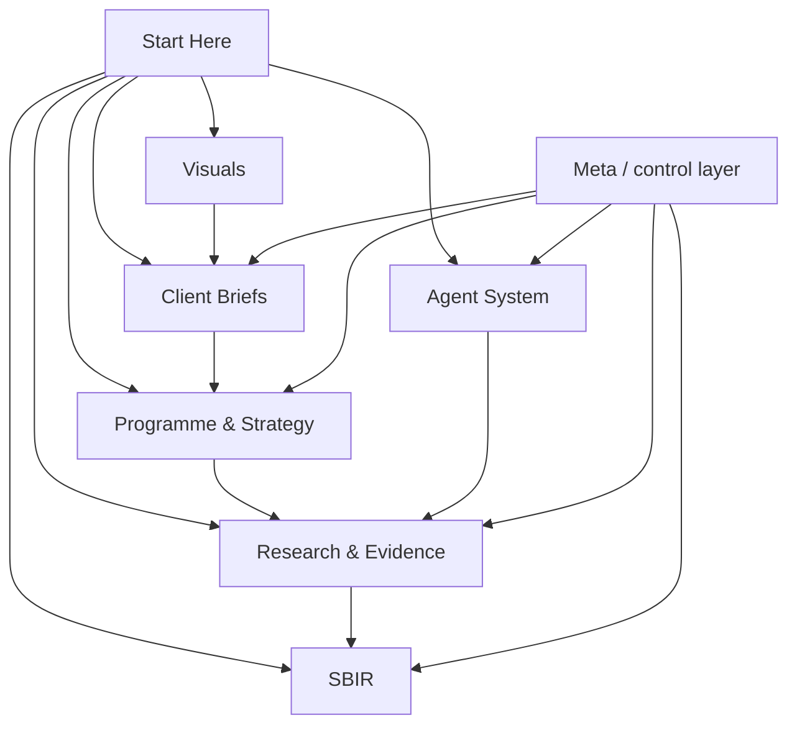

# Freight Trust Knowledge Base

**Team release:** `v0.9.2` · frozen 2026-08-08 for internal distribution. See [[README]], [[team-status-and-actions]], [[vault-inventory]], and [[CHANGELOG]].

**Operational memory:** [[06-team-memory/memory-moc]] holds tasks, agent runs, handoffs,
meetings, and reviewed shared memory. Root `AGENTS.md` orchestrates work through the
project personas in `.codex/agents/`; [[05-agent-system/guiding-routes]] retains the
domain-specific vault routes and evidence gates.

This is the canonical navigation layer for the Freight Trust research programme: client brief, research evidence, datasets and experiments, the agent operating system, SBIR preparation, and reusable visualizations, in one Obsidian vault.

> [!important] Working convention
> This vault is the sole source of truth for the programme. The legacy flat folders that predated this vault (research/, deliverables/, agents/, visuals/, raw/) were consolidated into the sections below and removed on 2026-08-02; their content remains in git history if it is ever needed, and there is no longer a parallel copy to keep in sync.

## Start with the right path

| If you need to… | Open |
|---|---|
| Understand the client request and programme at a glance | [[client-request-and-outcomes]] → [[01-client-briefs/client-briefs-moc]] |
| See current owners, blockers, and next actions | [[team-status-and-actions]] |
| Browse every active file | [[vault-inventory]] |
| Prepare an external conversation | [[01-client-briefs/freight-trust-client-master-brief]] |
| View only approved public materials | [[public/overview]] |
| Prepare an NSF application | [[04-sbir/nsf-sbir-sttr-process-and-readiness-guide]] → [[04-sbir/sbir-moc]] |
| Verify a research claim | [[03-research-evidence/research-evidence-moc]] → [[03-research-evidence/evidence]] |
| Understand the Terra/Luna/Rabbit research workflow | [[05-agent-system/agent-system-moc]] |
| Design or review the benchmark and Phase I experiments | [[03-research-evidence/datasets-and-experiments-moc]] |
| Reuse a diagram | [[07-visuals/visual-index]] |
| Understand how the vault itself is built and kept true | [[09-meta/meta-moc]] |
| Look up a term of art | [[09-meta/glossary]] |
| Find an external dataset and its access terms | [[09-meta/dataset-index]] |
| See what is currently broken or missing | [[09-meta/drift-control]] → [[09-meta/gap-register]] |

## Vault topology

## Core notes

- [[03-research-evidence/datasets-and-experiments-moc]] - benchmark, experiment, metric, and data-governance plan.

- [[01-client-briefs/freight-trust-client-master-brief]] — current client-facing narrative.
- [[02-programme-strategy/research-programme]] — complete research programme and logic.
- [[03-research-evidence/evidence]] — source-backed evidence register and confidence record.
- [[04-sbir/nsf-sbir-sttr-process-and-readiness-guide]] — application route, draft Pitch, and checklist.
- [[05-agent-system/framework]] — domain research workflow used by the root orchestrator and persona factory.
- [[09-meta/meta-moc]] — the control layer: schema, taxonomy, methodology, agents, loops, and registers.
- [[09-meta/client-common-action]] — who this work is for, and what about them is still unknown.

## Status at a glance

| Area | Current state | Next decision |
|---|---|---|
| Client narrative | Consolidated | Confirm priority audience and first pilot workflow. |
| Evidence | Sourced baseline assembled | Add primary interviews and permissioned benchmark data. |
| Datasets and experiments | E1 identity-definition RC1 source-grounded and hostile-reviewed; benchmark not yet built | PI/domain/counsel freeze, train adjudicators, pilot double-labeling, then construct E1 corpus and run baselines. |
| SBIR | Full draft package: Pitch, project description, budget, DMP, commercialization plan, risk register (all placeholder-gated) | Confirm legal form, SBIR/STTR route, PI effort/employment eligibility, and remaining personnel rates to resolve placeholders. |
| Agents | Framework, roles, and skill contract documented | Use the task-packet loop for each new research pass. |
| Vault machinery | Schema 1.0.0, seven-layer tag taxonomy, methodology, five agent layers and four loops defined | Team-release migration completed 2026-08-08; run the release audit before each subsequent distribution. |
| Client | Common Action is the confirmed applicant; Ellie Young is the confirmed PI; legal form, route, and PI employment/effort eligibility remain unresolved | Resolve the remaining `DEC-002` eligibility facts. |

### E1 methods hardening

[[e1-academic-design-review]] · [[e1-benchmark-sampling-and-split-plan]] · [[e1-statistical-analysis-and-preregistration-plan]]

- [[03-research-evidence/e1-academic-design-conformance-report]]
