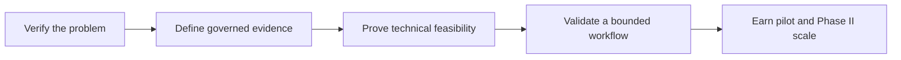

# Programme & Strategy

- [[03-research-evidence/datasets-and-experiments-moc]] - datasets, benchmark construction, experiments, and go/no-go metrics.
- [[03-research-evidence/improvement-suggestions]] - ten improvements to strengthen the programme.

- [[research-programme]] — full programme logic, scope, research questions, and delivery path.
- [[03-research-evidence/goals]] — G1–G14 research goals.
- [[03-research-evidence/plan]] — execution plan.
- [[03-research-evidence/operating-model]] — task packets, loops, quality gates, and escalation.

## Strategic through-line

