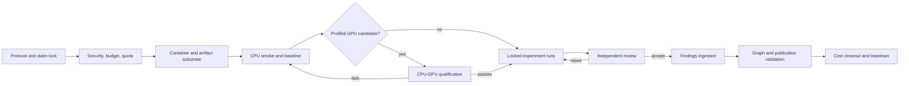

# AWS Experiment Execution and Findings Plan

This plan connects the E1-E5 protocols, AWS compute, and the canonical knowledge base. It
does not change an experiment's hypothesis, threshold, sample, or claim boundary. Those
remain controlled by [[experiment-protocol-standard]] and the experiment note.

## Operating decision

Use a **CPU-first, containerized AWS Batch architecture**. Promote a workload to a GPU
only when a frozen CPU run identifies a named accelerator-compatible bottleneck and a
small CPU-versus-GPU benchmark meets preregistered speed, cost, and numerical-equivalence
gates. None of the current E1-E5 protocols requires a GPU.

The initial platform should use AWS Batch with separate CPU and GPU queues on ECS/EC2,
immutable images in ECR, versioned artifacts in S3, and logs and metrics in CloudWatch.
Batch fits bounded, replayable research jobs and supports
[GPU jobs](https://docs.aws.amazon.com/batch/latest/userguide/gpu-jobs.html) and
[array jobs](https://docs.aws.amazon.com/en_en/batch/latest/userguide/array_jobs.html).
Use SageMaker Training only if E1 becomes a substantial learned-model workflow that needs
managed training, tuning, or model tracking; SageMaker has
[separate service quotas](https://docs.aws.amazon.com/sagemaker/latest/dg/regions-quotas.html).

### E1 LLM execution boundary

Treat LLM-assisted E1 methods as two distinct lanes. Do not combine their results under one
condition or change lanes after final-test access.

1. **Hosted-model lane:** send only approved public or redacted inputs to OpenRouter through a
   fixed, versioned model slug and a frozen provider policy. `openrouter/auto` is prohibited in
   experiments: its model pool can change and the router selects a model from the prompt, so it
   does not preserve a stable treatment. OpenRouter documents both that behavior and the returned
   selected model in its [Auto Router documentation](https://openrouter.ai/docs/guides/routing/routers/auto-router).
   Disable undeclared model fallbacks. If a fallback is scientifically required, preregister its
   ordered model list and analyze each actual model/provider route separately.
2. **Open-weight lane:** run a pinned weights revision locally in an AWS container. Record the
   weights, tokenizer, licence, revision/hash, runtime, quantization, context limit, decoding
   configuration, and any adapter. Only this lane may enter AWS GPU qualification. Fine-tuning is
   a separate preregistered condition with train/dev isolation, not an implementation detail.

The hosted lane consumes provider compute and does not justify an AWS accelerator. The
open-weight lane begins on CPU where feasible and may qualify one G-family GPU for local
inference or fine-tuning under Phase 4. AWS Batch requires GPU resources to be declared in the
job definition; see [Run GPU jobs](https://docs.aws.amazon.com/batch/latest/userguide/gpu-jobs.html).
Use SageMaker only when its managed-training features are needed, not merely because the method
contains an LLM.

For every hosted condition, freeze four canonical artifacts before evaluation:

- **Model manifest:** model slug and revision/date, declared context/features, pricing snapshot,
  and eligible fallback list (normally empty).
- **Provider manifest:** OpenRouter API/base version, provider allowlist and order, endpoint/data-
  policy snapshot and access date, `zdr: true`, `data_collection: "deny"`, and account/guardrail
  settings relevant to routing. OpenRouter supports per-request ZDR and provider routing controls
  ([ZDR](https://openrouter.ai/docs/guides/features/zdr),
  [provider selection](https://openrouter.ai/docs/guides/routing/provider-selection)).
- **Prompt manifest:** exact system/developer/user templates, prompt hash, examples, output schema,
  tool definitions, normalization/redaction rules, and prompt version. Case data is referenced by
  an input hash and opaque case ID rather than copied into the public manifest.
- **Request manifest:** experiment/condition/case, the three manifest hashes, request/response IDs,
  actual returned model/provider, parameters and supported seed, timestamps, attempt/retry/fallback
  lineage, HTTP/finish status, output and parsed-result hashes, and validation/abstention result.

ZDR and `data_collection: "deny"` are vendor-described routing controls, not independent proof of
confidentiality, regulatory compliance, privilege, contractual permission, deletion, residency,
or fitness for a specific dataset. OpenRouter states that provider policies differ and that it
stores request metadata such as token counts and latency; see
[Provider Logging](https://openrouter.ai/docs/guides/privacy/provider-logging/) and
[Data Collection](https://openrouter.ai/docs/guides/privacy/data-collection). Preserve the policy
snapshot and access date, obtain data-owner/legal approval where required, keep prompt logging and
input/output-use opt-ins disabled, and never send restricted, partner, adjudication, credential,
or direct-identifier data through the hosted lane.

## Readiness baseline — 2026-08-18

| Area | Verified state | Consequence |
|---|---|---|
| Local Python | Repository `.venv` exists and pinned dependencies install successfully | Use `.\.venv\Scripts\python.exe` for every Python command. |
| Providers | AWS STS and OpenRouter key-metadata checks pass | Credentials exist; service-specific authorization and budget are not proved. |
| Accelerator quota | On-Demand and Spot G/VT, P, Inf, and Trn quotas in `us-east-1` are all `0` vCPUs | No accelerator can launch until the relevant quota is approved. |
| Regional supply | Representative G, P, and newer GPU instance types have regional offerings | An offering is not a capacity guarantee. |
| Runtime substrate | No container, ECR image, IaC, GPU framework, CUDA dependency, or Batch/SageMaker runtime exists | Build and test the substrate first. |
| Experiment maturity | Protocols exist; benchmark construction, partner access, and numeric locks remain open | Start with CPU smoke tests and pilots, not final evaluation. |

Recheck this state before provisioning. EC2 accelerator quotas are separate by family and
purchase model; see [EC2 instance quotas](https://docs.aws.amazon.com/ec2/latest/instancetypes/ec2-instance-quotas.html)
and [quota management](https://docs.aws.amazon.com/AWSEC2/latest/UserGuide/ec2-resource-limits.html).

## Work graph



Every node has one owner, immutable inputs, a named output, and an acceptance check. A
failed gate returns only the failed artifact for at most two repair loops. Final-test
labels are never exposed to a repair loop.

## Experiment-to-compute map

| Experiment | Primary workload | Default AWS lane | GPU rule |
|---|---|---|---|
| [[experiment-e1-entity-resolution-and-identity-assurance]] | I/O-heavy normalization/retrieval; CPU probabilistic linkage; memory-heavy graph traversal; hosted or open-weight LLM-assisted resolution; parallel tuning and entity-level resampling | CPU Batch for classical methods; isolated egress-enabled hosted-model lane; local open-weight container lane | Optional only for local inference/fine-tuning or another preregistered learned embedding/GNN/neural matcher. Hosted API calls, deterministic/probabilistic baselines, adjudication, and resampling do not use AWS GPUs. |
| [[experiment-e2-facility-event-provenance-and-dwell-reconstruction]] | Independent generation, anomaly injection, reconstruction, privacy, and bootstrap jobs | CPU Batch with high-throughput S3 I/O | Unjustified unless a deep sequence model is added before protocol lock and separately qualified. |
| [[experiment-e3-federated-access-and-policy-enforcement]] | Deterministic conformance, adversarial, mutation, correction-lineage, and audit tests | Small CPU Batch jobs plus transactional test storage | Not necessary. |
| [[experiment-e4-participation-and-small-carrier-equity]] | Recruitment/human workflow, secure event logging, cluster-aware statistics | Restricted CPU analytics lane | Not scientifically relevant. |
| [[experiment-e5-orchestration-value]] | Parallel scenarios, constrained optimization, seeds, ablations, sensitivities, and Pareto analysis | Distributed CPU Batch | Optional only for a supported solver accelerator path or preregistered learned surrogate. Compare solution quality as well as runtime. |

GPU use is a compute optimization, never an experimental condition unless hardware is
explicitly part of the estimand. Changing hardware after final-test access is a deviation.

## Reference AWS architecture

1. **Identity:** operators use federated AWS access; jobs use least-privilege roles. No
   long-lived or console credentials enter environments, images, Git, logs, or run packets.
2. **Images:** ECR stores immutable, digest-addressed CPU and approved GPU images. Enable
   [image scanning](https://docs.aws.amazon.com/AmazonECR/latest/userguide/image-scanning.html)
   and pin the base image, OS packages, lockfile, driver/CUDA compatibility, solver/model,
   and entrypoint.
3. **Scheduling:** Batch owns distinct CPU, GPU On-Demand, and GPU Spot environments and
   queues, all scaling to zero. GPU definitions explicitly request GPU resources. CPU jobs
   do not consume GPU queues.
4. **Storage:** S3 uses versioning, encryption, blocked public access, lifecycle rules, and
   separate immutable-input, raw, derived, review, and release prefixes. Record object
   version IDs and [SHA-256 checksums](https://docs.aws.amazon.com/AmazonS3/latest/userguide/checking-object-integrity.html).
5. **Network:** use private subnets and restricted S3, ECR, and CloudWatch endpoints. Put
   OpenRouter work in a separate egress-enabled class using a managed secret, an explicit
   OpenRouter hostname allowlist where the network layer supports it, and no access to restricted
   S3 prefixes. Only approved redacted request payloads cross this data-egress boundary. Frozen
   local-model and classical research jobs receive no general outbound access.
6. **Observability:** CloudWatch records job state, exit reason, CPU/GPU utilization, memory,
   duration, retries, and bytes transferred. Logs exclude records, secrets, identifiers, and
   signed URLs.
7. **Controls:** AWS Budgets and cost tags cover experiment, run ID, owner, environment, and
   data class. Budget alerts can lag, so job definitions also need explicit
   [timeouts](https://docs.aws.amazon.com/batch/latest/userguide/job_timeouts.html), concurrency
   caps, retry policy, scale-to-zero, and teardown.
8. **Orchestration:** start with Batch dependencies. Add Step Functions only if human approval,
   branching, or cross-service recovery cannot be expressed cleanly in Batch. Do not introduce
   Kubernetes without a measured workload or team requirement.

## Capacity policy

- Request only quota needed for the next accepted workload. A conservative first ceiling is
  8 On-Demand G vCPUs and 16 Spot G vCPUs, subject to the exact selected instance. Keep P,
  Inf, and Trn at zero until a frozen compatible workload exists.
- Calculate the actual request as `largest instance vCPUs × maximum concurrent instances`,
  with modest retry headroom. Do not size from aspiration.
- Start with a small G-family instance for a qualified learned workload. Use P only after a
  measured VRAM or throughput need cannot be met economically on G. Defer Inferentia/Trainium
  until framework and Neuron portability are demonstrated.
- Use Spot with checkpointing and idempotent outputs for replayable development sweeps. Use
  On-Demand for short qualifications, reference baselines, non-checkpointable work, and the
  frozen one-shot run when interruption threatens validity.
- Quota approval, regional offering, and launchable capacity are different facts. Capacity
  failure is an infrastructure event, not an experimental result.

## Execution phases and gates

### Phase 0 — Freeze the scientific unit

Owner: experiment owner and research orchestrator; independent methods review.

- Select one bounded pilot. Recommendation: qualify infrastructure with E3, then run the E1
  development pilot.
- Freeze hypotheses, cohorts, conditions, outputs, thresholds, seeds, precision targets,
  stopping rules, and the CPU baseline command.
- For an E1 LLM condition, select the hosted or open-weight lane and freeze the model, provider,
  prompt, and request-manifest schemas. Fix the provider/fallback policy before opening final data.
- Classify inputs and confirm access, licence, consent, retention, correction, and release.

**Gate:** protocol G0 and data G1 pass. Amendments receive new versions and never overwrite
the preregistered artifact.

### Phase 1 — Establish the AWS safety envelope

Owner: infrastructure operator; security/data-governance review.

- Select account, region, IAM roles, KMS keys, network boundary, retention, budget, alerts,
  mandatory tags, maximum concurrency/runtime, and teardown owner.
- Test service permissions with a non-sensitive CPU job; STS success is insufficient.
- Leave GPU quotas at zero unless Phase 3 is expected to produce a named candidate.

**Gate:** exact-prefix S3/ECR/log access works; unrelated resources, public access, and
unapproved egress are denied; no static credential is present; budget and teardown are approved.

### Phase 2 — Build the reproducible substrate

Owner: runtime engineer; manifest review by `kb_schema_steward`.

- Add pinned CPU image, lockfile, Batch definition, ECR, S3 layout, infrastructure-as-code,
  sanitized logs, and one command that runs locally and remotely.
- Make jobs idempotent: inputs are read-only, outputs use run/attempt IDs, and complete output
  cannot be overwritten.
- Generate a machine-readable manifest and checksums before analysis.

**Gate:** one fixture produces equivalent local/AWS output; manifest recovers image digest,
commit, dependencies, inputs, configuration, hardware, logs, and outputs; create/destroy works.

### Phase 3 — Run CPU baselines and profile

Owner: experiment owner; review by `evidence_synthesizer`.

- Run simple baselines before proposed-method tuning.
- Measure wall time, CPU, RAM, I/O, parallelism, failures, and projected full-run cost. For an
  LLM condition also record prompt, completion, reasoning, cache-read/cache-write, and total
  tokens; end-to-end latency and time to first token when available; attempts, retries, fallbacks,
  timeouts, rate limits, parse/schema failures, abstentions, and charged cost. OpenRouter returns
  token and cost fields in each response; see
  [Usage Accounting](https://openrouter.ai/docs/cookbook/administration/usage-accounting).
- Report **cost per correct auto-resolution** at the frozen precision floor and review budget:
  total condition inference plus allocated runtime cost divided by correctly accepted automatic
  legal-person resolutions. Also report total cost, cost per attempted case, cost per reviewed
  case avoided, and the paired difference from C1; never optimize token price without correctness.
- Partition only on scientifically independent units: entity/resample for E1, trace/seed for
  E2, request case for E3, replicate for E4, and scenario/seed for E5.

**Gate:** protocol G2 passes and the run fits the approved cost/runtime envelope. Continue on
CPU unless a named accelerator-compatible component dominates runtime.

### Phase 4 — Qualify a GPU candidate when justified

Owner: runtime engineer and experiment owner; `red_team_reviewer` checks the comparison.

- Freeze input slice, CPU/GPU configurations, warm-up, repetitions, equivalence tolerance,
  speed target, cost denominator, and failure policy.
- Admit only local open-weight inference/fine-tuning or another locally executed accelerator-
  compatible component. Hosted OpenRouter latency or cost cannot qualify AWS GPU capacity.
- Compare end-to-end time and cost, output equivalence, determinism, memory, utilization,
  startup/image-pull time, and interruption recovery.
- Start with one small G instance and promote vertically only from observed evidence.

**Gate:** GPU satisfies frozen numerical/solution-quality tolerance and the declared time or
cost objective. Otherwise retain the negative result and close the GPU lane. Passing authorizes
only that image, workload class, and family.

### Phase 5 — Execute locked runs

Owner: experiment owner; operator may launch but not change protocol inputs.

- Tune only inside the frozen development split and budget. Open the final test once.
- Retain raw predictions/results before calculating metrics.
- Distinguish retry, Spot interruption, OOM, numerical fault, missing input, manual cancel,
  scientific null, and assertion failure. Never silently discard an attempt.
- In the hosted lane, preserve every request attempt and the actual returned model/provider.
  Provider failover or a changed model is a treatment deviation unless it was preregistered.
- Keep E4 identifiers and all restricted partner data outside the public vault.

**Gate:** protocol G3 passes; every attempt has an immutable manifest, exit reason, logs, and
outputs or explicit failure record.

### Phase 6 — Review before interpretation

Owner: independent `red_team_reviewer`; structure check by `kb_schema_steward`.

Review leakage, post-hoc changes, weights, uncertainty, missingness, subgroup precision,
oracle assumptions, solver artifacts, privacy, equity, failed-run suppression, and compute
selection bias. E1 also uses [[e1-reporting-and-reproducibility-checklist]].

**Gate:** protocol G4 passes; each finding is accepted, repaired without test leakage, or
carried into limitations with an owner.

### Phase 7 — Ingest findings into the graph

Owner: `memory_keeper` for runs, `evidence_synthesizer` for findings/claims, `kb_linker` for
integration.

1. Create one atomic task and one `agent-run` note under `06-team-memory/tasks/` and
   `06-team-memory/runs/`. Do not duplicate new runs in historical [[run-log]].
2. Register external inputs as `source` or `dataset` notes with access, licence, verification,
   dates, and limits. A failed retrieval remains a negative finding.
3. Create a candidate `evidence` finding note for the experiment. Separate primary,
   secondary/exploratory, subgroup, safety/privacy/equity, deviations, nulls, failure codes,
   supported result category, limits, and prohibited interpretations.
4. When downstream reuse is expected, create one atomic `claim-ft-######` note per falsifiable
   proposition under `03-research-evidence/claims/`. Include cohort/population, period, method,
   estimate/interval, finding/run sources, confidence class, limits, and explicit graph edges.
5. Start agent-derived findings and claims as `candidate`. An authorized reviewer promotes
   findings to `current` and claims to `active`; hardware observations are not scientific claims.
6. Link experiment, protocol, datasets, task, run, finding, claims, goals, decision gate, and
   contradictions/supersessions in both directions. Update MOCs and release records only after
   acceptance.

**Gate:** protocol G5 passes; every public statement traces to a reviewed claim and immutable
run packet, and no raw/secret/participant data is tracked by Git.

### Phase 8 — Validate, publish, and close cost

Owner: research orchestrator.

- Validate metadata, IDs, links, reachability, and the site. Inspect experiment -> run ->
  dataset -> finding -> claim -> decision paths.
- Reconcile billed/projected cost; explain variance; expire scratch data; scale to zero;
  remove temporary access; retain only required artifacts.
- Commit, push, and deploy only when explicitly authorized. Local findings are not published.

**Gate:** validations pass, cost balances, teardown is verified, and the run outcome is explicit.

## Canonical run packet

Use `run-YYYYMMDD-###` for the public orchestration record and a collision-resistant cloud ID
such as `e1-20260818T153000Z-<gitshort>-<nonce>`.

```text
run-manifest.json    # protocol, code, image, hardware, timestamps, attempt lineage
input-manifest.json  # object versions, hashes, schemas, licences, data class
model-manifest.json  # exact hosted model or local weights/tokenizer/runtime identity
provider-manifest.json # routing, endpoint policy, ZDR/data-collection settings and snapshot
prompt-manifest.json # exact templates/schema/tools/redaction rules and content hash
requests.jsonl       # one sanitized request/response/attempt lineage record per case
config/              # model, solver, policy, scenarios, seeds, thresholds
environment/         # lockfile, image digest, OS, driver/CUDA, instance metadata
logs/                # sanitized application and infrastructure logs
raw/                 # outputs before metric computation
derived/             # metrics, intervals, plots, profiler summaries
review/              # deviations, findings, approvals, dispositions
release/             # redacted, reviewed artifacts eligible for publication
checksums.sha256
```

The manifest records experiment/condition, protocol version/hash, Git commit and dirty flag,
image digest, command, seeds, input version IDs/hashes, configuration hashes, instance and
accelerator, region/AZ, CPU/RAM/GPU, libraries/drivers, timestamps, attempt ancestry, exit
reason, output hashes, data class, retention date, cost tags, and reviewer status. The public
run note contains only safe opaque locators and hashes—never credentials, account IDs, direct
identifiers, bucket names where sensitive, presigned URLs, or private network details.

An LLM packet additionally records the model/provider/prompt/request manifest hashes; actual
model and provider; all sampling/decoding parameters; token counts by category; charged and
allocated runtime cost; latency; retry/fallback/error lineage; output-schema validity; abstention;
and correctness disposition after blinded scoring. Raw prompts and responses stay in the
restricted layer when they contain case material, even if they were redacted for provider use.

Use three layers: raw restricted, derived restricted, and public/redacted. Every derived
artifact declares `derived_from`; every public claim links to its finding. A retry or amendment
gets a new attempt path and predecessor link. Nothing overwrites raw or earlier findings.

## Cost, safety, and stop rules

- No quota request without a workload owner, budget, termination date, and qualification gate.
- No P-family run until G profiling demonstrates why G cannot meet the requirement.
- Stop at the frozen budget, retry count, or precision target.
- Stop on public exposure, credential leakage, missing encryption, unapproved egress,
  checksum mismatch, test-label leakage, or unbounded spend.
- Quarantine incomplete packets until their incident/review record exists.
- Do not classify infrastructure failure as a scientific null.
- Do not send restricted records through OpenRouter. The hosted lane accepts only public or
  specifically approved redacted artifacts, with `zdr: true`, `data_collection: "deny"`, prompt
  logging/input-output use disabled, and a frozen model/provider policy. These controls do not
  replace licence, consent, contract, privacy, residency, retention, or legal review.
- Stop an LLM run on undeclared model/provider fallback, policy-snapshot drift, unapproved egress,
  missing request lineage, or a response that cannot be tied to the frozen manifests.

## Implementation backlog

| ID | Work | Depends on | Acceptance |
|---|---|---|---|
| AWS-01 | Select pilot; freeze protocol/data class | — | Phase 0 gate |
| AWS-02 | Account, region, IAM, KMS, network, budget, tags, retention | AWS-01 | Security review and CPU permission test |
| AWS-03 | IaC for S3, ECR, Batch CPU, logs, alerts, teardown | AWS-02 | Clean create/smoke/destroy |
| AWS-04 | Pinned CPU image and local/AWS entrypoint | AWS-03 | Fixture equivalence and manifest |
| AWS-05 | Run-packet schema, hashing, lineage, redaction, validator | AWS-04 | Corruption/overwrite/secret-negative tests |
| AWS-06 | Selected CPU pilot and profile | AWS-05 | Baseline lock and cost/runtime report |
| AWS-07 | Decide whether GPU candidate exists | AWS-06 | Named candidate/gate or closed lane |
| AWS-08 | Minimal G quota and GPU image/queue only if approved | AWS-07 | Driver smoke and scale-to-zero |
| AWS-09 | CPU-GPU qualification | AWS-08 | Equivalence plus cost/time gate |
| AWS-10 | Execute, review, ingest, validate, close | AWS-06 or AWS-09 | Phases 5-8 gates |

The critical path is scientific lock -> safe CPU substrate -> measured pilot -> accelerator
decision. Do not begin with AWS-08.

## Validation

```powershell
.\.venv\Scripts\python.exe scripts\check_runtime.py --live
.\.venv\Scripts\python.exe scripts\validate_kb.py
.\.venv\Scripts\python.exe -m unittest discover -s tests -p "test_*.py" -v
.\.venv\Scripts\python.exe scripts\build_site.py --site-url https://csandbatch.github.io/freight-trust-knowledge-base/
.\.venv\Scripts\python.exe scripts\validate_site.py --check-deterministic
git diff --check
```

## Human decisions still required

- Confirm the first pilot: E3 substrate qualification, then E1 development pilot.
- Name AWS account, budget owner/ceiling, region, data owner, and teardown owner.
- Identify partner requirements for account isolation, connectivity, retention, and destruction.
- Name approvers for amendments, final-test opening, claim promotion, and GPU spend/quota.
- Decide whether E5 is Phase I or deferred to Phase II.

## Related

[[datasets-and-experiments-moc]] · [[research-evidence-moc]] · [[goals]] ·
[[experiment-protocol-standard]] · [[e1-statistical-analysis-and-preregistration-plan]] ·
[[e1-reporting-and-reproducibility-checklist]] · [[09-meta/methodology]] ·
[[09-meta/kb-schema]] · [[09-meta/publication-runbook]]
