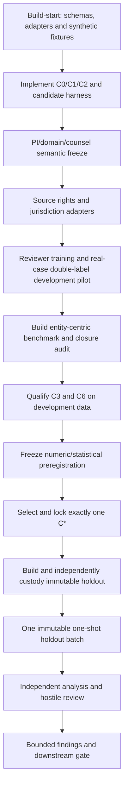

# E1 Experiment Brief and Readiness Map

E1 asks whether source-attributed records can be resolved to the correct **legal-person
partition** under missing, corrupted, conflicting and time-forward evidence, at a precision level
safe enough for a bounded carrier-onboarding workflow. It is an evaluation of identity-resolution
methods and review policy—not a fraud detector, legal opinion, carrier score or autonomous
eligibility system.

## The essential semantic model

“Same carrier” is not one label. E1 freezes separate objects and tasks:

| Layer | Question | E1 representation | What must not be inferred |
|---|---|---|---|
| Task A — legal person | Do two observations refer to the same legal person? | canonical partition with `SAME_LEGAL_PERSON`, `DISTINCT_LEGAL_PERSON`, `UNRESOLVED`, `OUT_OF_SCOPE` | Shared address, owner, authority, truck, phone or operating similarity is not identity |
| Task B — registration | Which person is authoritatively assigned a USDOT/registration state, and is the registrant continuous? | assignment and continuity states separate from Task A | Claimed identifier is not assignment; operating authority is not identity |
| Task C — relationships | What ownership, control, succession, transaction or substantial-continuity relationship is supported? | typed, directed, time-aware edges with source authority | A relationship does not collapse two legal-person nodes |
| Regulatory disposition | Has a competent authority issued a reincarnation/affiliation or related determination? | separately sourced disposition with status and effective time | A model may not self-issue an agency/legal finding |

The controlling human contract is [[e1-carrier-identity-and-relationship-standard]], with the
machine schema in [[e1-identity-ontology.yaml]] and reviewer workflow in
[[e1-adjudication-decision-tree]]. The 64-claim ledger and 70-case conformance suite support
semantic review; they do not demonstrate scientific performance.

## What is being compared

| Condition | Role | Confirmatory status |
|---|---|---|
| `C0` | Documented manual/current operational workflow | Operational comparator; not gold truth |
| `C1` | Constructed transparent deterministic rules | Primary benchmark baseline |
| `C2` | Frozen probabilistic record-linkage model | Eligible for development selection |
| `C3` | Frozen graph-assisted temporal/relationship model | Eligible for development selection; graph increment also tested secondarily |
| `C4` | Selected `C*` with a separate operational reviewer panel | Secondary workflow correctness/time/burden study |
| `C5` | Real and generated hard-case challenge set | Failure discovery only; no population claim |
| `C6-LLM` | Evidence-bounded, schema-constrained LLM resolver | Eligible only if every frozen development, privacy and safety gate passes |

Exactly one eligible `C2`, `C3` or gate-qualified `C6` becomes `C*` through a preregistered
development-only algorithm. A favorable final-test result cannot select or modify it.

## Evaluation views and cohorts

- **End to end:** each method includes its frozen candidate-generation/blocking pipeline. This is
  the deployment-relevant primary view.
- **Common candidate set:** resolvers receive the same broad candidates and case evidence to
  isolate scoring/reasoning effects. It is an ablation, not the primary deployment result.
- **Cohort R:** probability-sampled/entity-centric reference cohort for design-weighted estimates.
- **Cohort H:** purposive hard and adversarial cases for mechanisms and stress only.
- **Cohort J:** optional jurisdiction/source-environment holdout; it is external evidence only for
  the source environment actually held out.

Feature regimes `F0–F6` distinguish anchor-visible diagnostics from masked, missing, corrupted,
conflicting, relational and time-forward conditions. `F0` cannot headline because exposing the
authoritative identifier used to establish reference identity can reduce evaluation to lookup.

## Primary decision rule

The final test is hierarchical:

1. **Safety:** the lower 95% confidence bound for `C*` design-weighted automatic assignment
   precision must meet the preregistered floor `P*`.
2. **Utility:** only after safety passes, the lower 95% confidence bound for paired assignment-
   yield improvement over `C1` must exceed `Delta*` at the same review budget.

The joint decision gate is accompanied by separate `LINK_EXISTING` and `CREATE_NEW` confusion,
precision, recall/yield and harm reporting because false attachment and false new-entity creation
have different consequences. Clustering, blocking recall, calibration, risk–coverage, reviewer
burden, subgroup effects, reference-standard uncertainty, latency and cost remain required.

`P*`, `Delta*`, review budget, sample size, subgroup precision, interval method, thresholds and
selection tie-break are intentionally unset until the development pilot. The pilot must freeze
the exact algorithm before the holdout is opened; plausible numbers may not be inserted now.

## LLM boundary

[[method-llm-assisted-entity-resolution]] permits a fixed hosted or open-weight system only as a
resolver/reranker over supplied evidence. It cannot browse, construct gold, cite unknown evidence,
or make legal/regulatory findings. The run freezes model, provider, prompt, schema, evidence view,
routing/fallback, reconciliation, calibration, retry, cost and privacy controls.

Hosted pretraining contamination cannot be proved absent. Diagnostics can reveal sensitivity but
cannot establish clean temporal learning. A C6 result therefore applies only to the exact dated
black-box configuration and evidence interface that ran. Dynamic `openrouter/auto` routing is not
eligible for controlled comparison.

## Execution path

## Readiness ledger

| Component | Current state | Required before final evaluation |
|---|---|---|
| Identity semantics | `1.0.0-rc1` freeze candidate; structural conformance passed | PI, freight/FMCSA, counsel and full 70-case human review |
| Reference standard | Specification exists | reviewer qualification, real-case retrieval, double labels, disagreement analysis and adjudication |
| Data/source rights | public routes partly confirmed; state adapters piloted for Louisiana/Texas | field-level authority, licence/redistribution, automation and hosted-egress approval |
| Sampling and estimand | entity-centric design specified | duplicate-anchor estimator, cluster-closure target population/sensitivity and source-route audit frozen |
| C0/C1/C2 | specifications only | executable, tested, versioned implementations and documented manual workflow |
| C3 | specification only | graph construction, leakage audit, reconciliation and development qualification |
| C6 | protocol-specified, `GAP-018` open | fixed model/configuration, privacy approval, calibrator, adversarial harness, cost and promotion gates |
| Numeric analysis | placeholders intentionally retained | freeze values, interval behavior, operating-point algorithm, selection score/tie-break and one-shot batch contents |
| Holdout | not built/opened | independent custody, access log, immutable manifests and preregistration version |
| Result | none | complete run packet, raw predictions, independent review and accepted finding |

## Build-start specification

E1 is build-ready for development fixtures, not pilot- or confirmatory-ready. Start with
machine-readable observation, evidence, candidate, gold-review, prediction, split and run
schemas; a source-adapter interface carrying snapshot date/hash, field map, temporal coverage,
rights and sensitivity; a versioned `C1` rule table; and one Fellegi-Sunter `C2` reference
baseline. Every condition uses the same candidate and prediction interfaces and the common run
manifest in [[e1-e5-build-readiness-and-run-contract]].

The first CLI must validate inputs, ingest only an approved development snapshot, generate
candidates, run `C1`/`C2` on development fixtures and score without holdout access. Acceptance is
the 70-case conformance suite, duplicated-anchor estimator simulation, permutation stability,
chronology/leakage negative tests, evidence-ID rejection and one reproducible local CPU packet.
No synthetic corruption case is legal-person gold; it is development/challenge evidence only.

## What a result would and would not support

A positive E1 result can support the frozen method and review policy for the declared population,
jurisdictions, sources, time window, feature regime, cost and benchmark. It does not establish an
individual legal identity, fraud/chameleon status, nationwide generalization, production fitness,
safety improvement, or autonomous eligibility use. A null remains valuable: it can show that
transparent rules are sufficient, graph/LLM complexity does not pay, source closure is too weak,
or safe coverage is too low.

## PI decisions still required

- Approve or amend the semantic standard and competent-source rules.
- Name freight/FMCSA, counsel/domain, adjudication and operational-review roles and conflicts.
- Approve benchmark population, jurisdictions, rights posture and source-access budget.
- Approve the harm ordering for false link, false new entity and abstention/review.
- After the development pilot, approve `P*`, `Delta*`, review budget, sample size, subgroup gates,
  interval method, exact selection algorithm and test-opening custodian.
- Decide whether C6 closes [[09-meta/gaps/gap-018-e1-llm-readiness]] and is eligible to compete.

## Reading route

1. [[experiment-e1-entity-resolution-and-identity-assurance]] — controlling scientific protocol.
2. [[e1-carrier-identity-and-relationship-standard]] — semantic authority.
3. [[e1-benchmark-sampling-and-split-plan]] — population, cohorts, closure and chronology.
4. [[e1-statistical-analysis-and-preregistration-plan]] — estimands, gates and uncertainty.
5. [[dataset-e1-adjudicated-carrier-identity-cases]] — reference-corpus contract.
6. [[e1-reporting-and-reproducibility-checklist]] — execution and reporting gate.
7. [[method-llm-assisted-entity-resolution]] — C6-specific contract.
8. [[integrated-e1-e5-research-programme]] — downstream interfaces and phase boundary.
