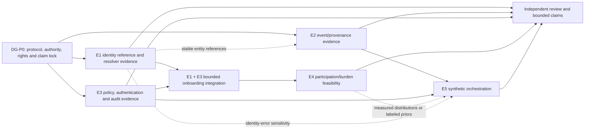

# Integrated E1–E5 Research Programme

This note is the cross-experiment contract for the Freight Trust research programme. The five
experiments are a portfolio, not a single cascading proof. They share typed interfaces and
decision gates, but a positive downstream result cannot retroactively validate an upstream
experiment, and an upstream null does not erase independently useful outputs.

## Programme claim

The programme tests whether source-attributed, time-aware, correctable, purpose-governed evidence
can improve a bounded freight decision under explicit uncertainty and participant protections.
It does **not** assume that a knowledge graph, federation, an LLM, or an optimizer reduces fraud,
detention, empty miles, liability, or safety risk. Those outcomes require separate evidence at
the result level stated below.

## Portfolio roles and phase boundary

| Experiment | Scientific role | Phase I commitment | Later/conditional work | Claim boundary |
|---|---|---|---|---|
| [[experiment-e1-entity-resolution-and-identity-assurance|E1 — identity]] | Establish whether observations can be resolved to the correct legal-person partition while keeping registration, relationships, continuity and regulatory disposition separate | Semantic freeze, adjudicated reference benchmark, transparent/probabilistic candidates, qualified graph/LLM challengers, one-shot benchmark evaluation | Broader jurisdiction/source validation and production workflow evidence | No individual legal determination, fraud label, national validity or autonomous consequential use |
| [[experiment-e2-facility-event-provenance-and-dwell-reconstruction|E2 — events]] | Test event reconstruction, omission/anomaly detection, uncertainty, correction and privacy/utility on hidden-truth traces | Freight-profiled synthetic benchmark and separate optional permissioned holdout | Real-facility calibration and operational dispute evaluation | Synthetic trace results are not tamper proof, detention adjudication or real-facility performance |
| [[experiment-e3-federated-access-and-policy-enforcement|E3 — governed access]] | Test whether an approved freight policy is implemented, authenticated, audited and corrected as specified | Versioned policy corpus, authenticated enforcement lane, independent oracle, audit reconciliation and correction tests | Multi-party legal/contractual policy operation and hardened privacy/security | Passing supports measured conformance to the frozen oracle/test suite only for the pinned policy, adapter and engine—not legal compliance or policy legitimacy |
| [[experiment-e4-participation-and-small-carrier-equity|E4 — participation]] | Measure whether a concrete reciprocal offer is usable, understood and proportionate | Instrument, recruitment and burden-measure feasibility; directional pilot only if institutionally approved and resourced | Powered clustered/two-stage field experiment | No industry adoption claim; no causal language without adequate assignment, exposure and precision |
| [[experiment-e5-orchestration-value|E5 — application value]] | Test whether governed cross-actor information changes a bounded planning decision without shifting service, safety, margin or burden | Scenario/constraint specification, solver validation and optional CPU feasibility smoke test | Preregistered orchestration experiment and permissioned external validation | Synthetic result is bounded decision evidence, never industry-scale empty-mile/detention impact |

The NSF Phase I bounded workflow remains carrier onboarding/identity verification: E1 supplies the
identity capability and E3 supplies governed access/correction. E2 is a separate Phase I research
validation on the same evidence architecture. E4 is cross-cutting feasibility unless its human-
subjects, partner, budget and design gates are explicitly funded. E5 is specified in Phase I and
defaults to Phase II execution unless an accepted late-Phase-I scope change resources it.

## Work and dependency graph

Public/synthetic fixture scaffolding for E1, E2 and E3 may build in parallel now under
[[e1-e5-build-readiness-and-run-contract]]. Data-backed pilots still require the common lock. E2 needs stable E1 identifiers only
when traces refer to real carrier entities; it must not use E1 truth labels as event features.
E5 simulator and solver mechanics may be developed with labeled synthetic priors, but an
identity-, governance-, participation- or real-dwell-specific claim requires the corresponding
accepted upstream evidence.

## Versioned interface contract

Every exchanged artifact carries `schema_version`, producer experiment/run, source and data-
rights manifests, observation/valid time, correction status, uncertainty semantics, and a content
hash. A consumer freezes the exact upstream version; later corrections create a new input version
and do not silently rewrite a completed run.

| Producer | Minimum downstream-safe output | Permitted consumers | Prohibited inference |
|---|---|---|---|
| E1 | opaque legal-person reference; Task A state; separate Task B/C/disposition fields; supporting evidence IDs; feature cutoff; calibrated score/set or abstention; correction/version state; source authority and rights | E3 subjects/roles, E4 onboarding workflow, optional E2 trace references, E5 identity-error sensitivity | Relationship, shared field, continuity signal or model score is not legal-person equality; E1 output is not fraud or regulatory disposition |
| E2 | event assertion/reference; EPCIS/CBV crosswalk; event and record times with clock quality; observed/inferred/unresolved/censored state; source/provenance; anomaly family; uncertainty interval; correction and access-purpose state | E3 protected event-summary resources; E4 correction burden; E5 event-quality and timing priors | Generated trace is not observed facility behavior; anomaly is not proof of malicious tampering; absence is not nonoccurrence |
| E3 | authenticated subject and policy version; domain decision plus engine mapping; field/redaction/review obligations; purpose/expiry; decision rationale; correction lineage; independently reconciled audit reference | E1+E3 pilot, E4 participant workflow, E5 governed planner | Engine conformance is not policy correctness, consent, legal compliance, confidentiality or participant willingness |
| E4 | disclosure-controlled aggregate activation, repeat use, burden, comprehension, refusal, correction and exposure estimates with sampling frame and uncertainty | programme adoption decision; E5 participation ranges after acceptance | Raw/pseudonymized participant records never enter this public vault; recruited-sample effects are not sector adoption |
| E5 | scenario/solver manifests; policy and stress axes; service/safety/cost/distribution outcomes; intervals, sensitivities, ablations and Pareto sets | Phase II decision | Oracle-only, synthetic-only, weight-sensitive or unsafe gains do not support deployment or industry outcomes |

## Decision gates and namespace

The `DG-*` namespace is reserved for programme decisions and avoids collision with research goals
`G1–G14` and protocol quality gates `G0–G5` in [[experiment-protocol-standard]].

| Gate | Evidence required | Decision enabled |
|---|---|---|
| `DG-P0` | Versioned protocols; semantic and policy authority; data access/licence/retention; privacy/publication boundary; hypotheses, estimands and freeze owners | Begin benchmark/pilot construction |
| `DG-E1` | E1 safety then yield result, reference-standard sensitivity, subgroup/closure report and reproducibility packet | Advance, narrow or stop identity capability |
| `DG-E2` | Synthetic result with scoped claims, privacy/utility review and separately reported partner holdout if available | Advance event research or redesign; never infer real facility validity from synthetic data |
| `DG-E3` | Authenticated high-risk policy tests, decision mapping, PEP/PDP audit reconciliation, correction and privacy results | Permit bounded E1+E3 integration or redesign |
| `DG-E4` | Institutional determination, recruited-frame and assignment/exposure record, burden/comprehension and disclosure-controlled results | Fund powered participation work, redesign offers, or stop |
| `DG-E5` | Solver validity, deployable-policy comparison, stress/sensitivity and actor-level non-inferiority gates | Consider Phase II orchestration; never authorize deployment by itself |

## Shared evidence and result ladder

1. **Protocol-specified:** a falsifiable method and decision rule exist; no implementation or result implied.
2. **Build-feasible:** a pinned implementation runs on fixtures and produces a complete run packet.
3. **Effective in a declared benchmark:** it passes frozen comparison and uncertainty rules on that benchmark.
4. **Operationally useful in a bounded workflow:** it changes a real workflow outcome under realistic permissions and burdens.
5. **Externally supported:** it survives a genuinely held-out time, jurisdiction, partner or scenario.
6. **Safe to advance:** independent review accepts privacy, equity, policy, misuse and correction evidence for the next bounded use.

No level inherits the next. Synthetic effectiveness cannot become operational utility; a public
download cannot become redistribution permission; policy-engine conformance cannot become legal
compliance; and a model prediction cannot become adjudicated truth.

## Cross-programme freeze checklist

- Qualify every use of `G#` as research goal, protocol quality gate, or replace programme gate
  references with `DG-*`.
- Freeze the Phase I workflow and distinguish experiment IDs from SBIR Aim numbers.
- Name the authority, version, owner, review status and uncertainty semantics of every upstream
  field consumed downstream.
- Define exact estimators, thresholds, tie-breaks, missing/error denominators and sparse-case
  interval behavior before final data access.
- Separate observed data, generated traces, authored priors, vendor assertions, official
  guidance, standards requirements and legal rules.
- Keep credentials, partner records, adjudicator packets and participant-level E4 data outside
  this public Git corpus.
- Open a final holdout once in one immutable batch; preserve nulls, failures and deviations.
- Publish only reviewed findings whose run, protocol, inputs, code/configuration and limits are
  traceable.

## Current programme state

All five experiments remain unrun. Their documentation is now build-start-ready: each has a
bounded first implementation slice, fixture acceptance checks, common run manifest and explicit
data/authority gates. None is yet `Build-feasible`, because no pinned implementation has produced
a complete fixture run packet. E1 still needs human freeze, benchmark work, and an institutional
or sponsor determination before reviewer-behavior research; E2 needs that same determination
before its reviewer experiment; E2/E3 also need qualified systems and frozen numeric/privacy
oracles; E4 has no participants or institutional
determination; E5 has no qualified simulator/solver. [[09-meta/gaps/gap-019-e1-e5-programme-readiness]]
tracks the remaining pilot and confirmatory locks.

## Related

[[e1-experiment-brief-and-readiness-map]] · [[e1-e5-build-readiness-and-run-contract]] · [[datasets-and-experiments-moc]] ·
[[aws-experiment-execution-and-findings-plan]] · [[experiment-protocol-standard]] ·
[[09-meta/methodology]]
