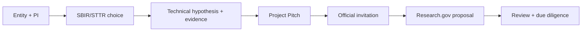

# NSF SBIR/STTR

## Dataset and experiment backbone

- [[03-research-evidence/datasets-and-experiments-moc]] - canonical dataset, benchmark, and experiment plan supporting the Phase I case.

- [[nsf-sbir-sttr-process-and-readiness-guide]] — current process, eligibility gate, Project Pitch scaffold, proposal plan, and official sources.
- [[01-client-briefs/freight-trust-client-master-brief#NSF SBIR/STTR framing]] — funding case within the wider programme.
- [[03-research-evidence/goals]] — source research goal.

## Folder structure

This section holds three kinds of material, now separated into subfolders so drafts, reference guides, and QA output don't sit flat in one pile:

- **04-sbir/** (this level) — stable reference material: this MOC, the readiness guide, and the evidence refresh.
- **`04-sbir/drafts/`** — the six working proposal documents (Pitch, Project Description, Budget, DMP, Commercialization Plan, Risk Register).
- **04-sbir/review/** — independent review output (Proposal Review Notes).

## Proposal package (drafts, 2026-08-01)

- [[project-pitch-draft]] — the four NSF Pitch fields, character-checked, with a facts-required checklist.
- [[phase-1-project-description-draft]] — full technical narrative: aims 1–3, work plan, milestones, broader impacts, Phase II trajectory.
- [[phase-1-budget-and-justification-draft]] — $305K/12-month skeleton with the ≥2/3 small-business share check.
- [[data-management-plan-draft]] — field-level data classes, provenance, retention, sharing, and redress records.
- [[commercialization-plan-draft]] — beachhead buyer hypothesis, alternatives, business model, evidence still required.
- [[technical-risk-register]] — material risks mapped to Phase I experiments and go/no-go milestones.

## Evidence and review

- [[sbir-evidence-refresh]] — 2026-08-01 verification of solicitation facts plus current market/fraud evidence.
- [[proposal-review-notes]] — independent review findings across the package (now in 04-sbir/review/).
- [[03-research-evidence/dataset-scan-entity-resolution]] / [[03-research-evidence/dataset-scan-event-provenance-and-federation]] — real datasets and tooling for synthetic Phase I benchmark experiments (Aims 1–3); findings are incorporated into the Project Description.

Supporting visuals: [[07-visuals/visual-index#Phase I technical architecture|Phase I technical architecture]], Phase I work plan, and the SBIR submission map (diagrams 06–08).

## Phase I readiness sequence

## Immediate decisions

- [ ] Confirm small-business eligibility, ownership, and affiliate status.
- [ ] Confirm a PI who can meet NSF employment requirements at award.
- [ ] Select a narrow buyer/workflow and a measurable R&D hypothesis.
- [ ] Confirm data rights and pilot partners.
- [ ] Draft and submit the Project Pitch.
