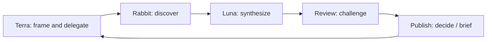

# Agent System

The executable orchestration policy is repository-root `AGENTS.md`; project-scoped Codex
personas live in `.codex/agents/`. Those runtime files sit outside `knowledge-base/` so
they are not published as research corpus. This MOC retains the domain operating model,
evidence rules, and historical handoff design.

## Control plane

- [[framework]] — Terra orchestration, Luna synthesis, Rabbit discovery, loops, and stop conditions.
- [[guiding-routes]] — request-to-role routing, acceptance gates, handoffs, and exit checks.
- [[roster]] — roles and handoffs.
- [[mcp-capabilities]] — tool and connector boundaries.
- [[tools-and-skills]] — current tool/skill roster.
- [[runtime/runtime-moc]] — portable runtime specifications and Git/PR agent contract.

## Runtime personas

The root persona factory consolidates the former role notes into narrow custom agents:
`source_scout`, `dataset_registrar`, `evidence_synthesizer`, `graph_engineer`,
`kb_schema_steward`, `kb_linker`, `glossary_builder`, `drift_controller`,
`red_team_reviewer`, `memory_keeper`, `publisher`, `visualization_engineer`, and
`ai_tell_editor`. The root orchestrator owns routing, integration, and completion gates.

## Reusable research skill

- [[05-agent-system/skills/freight-trust-research/SKILL]]
- [[05-agent-system/skills/freight-trust-research/references/artifact-contracts]]
- [[05-agent-system/skills/freight-trust-research/references/source-policy]]

## Operating loop

