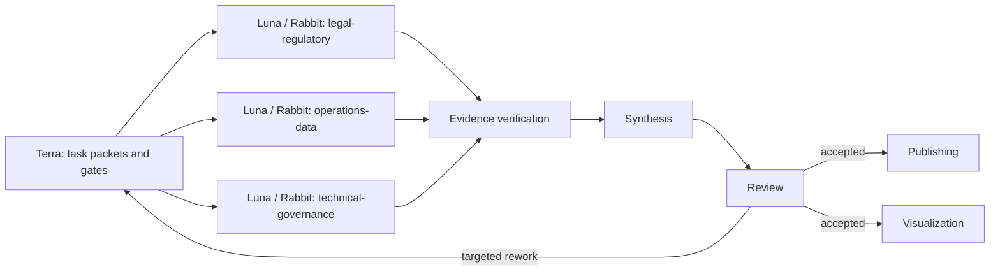

# Freight Trust Agent Framework

## Control model

**Terra** owns research-cycle decomposition, routing, acceptance gates, and escalation.
**Luna** is a bounded subagent role used for independent source domains. **Rabbit** is the
discovery mode Luna uses; it collects without resolving contradictions. Synthesis, Review,
Publishing, and Visualization retain their existing artifact ownership.

## Agent boundaries

| Role | May do | Must not do |
|---|---|---|
| Terra | Decompose, assign, gate, stop, escalate | Resolve evidence disputes by assertion |
| Luna/Rabbit | Retrieve, extract, compare, flag conflicts | Write settled conclusions or change scope |
| Evidence verifier | Check source fit, freshness, and claim support | Invent missing evidence |
| Synthesis | Build a coherent, uncertainty-labeled argument | Introduce unsupported facts |
| Review | Stress-test and route findings | Close its own evidence objection without new evidence |
| Publishing/Visualization | Translate accepted material | Add facts or conceal open findings |

## Cycle contract

Every task uses the task-packet, evidence-entry, and review-finding schemas in the project
skill. Status is `queued`, `running`, `submitted`, `verified`, `accepted`, `unverified`,
`contradicted`, `blocked`, or `rejected`. Two retries is the default cap; Terra escalates
high-severity unresolved findings to the human owner.

## Operating routes

Before assigning work, Terra applies [[guiding-routes]]. It turns a request into the
responsible role, expected artifact, verification gate, and escalation owner. This keeps
maintenance roles (schema, links, drift, memory) separate from research and publication
work, and prevents a downstream deliverable from bypassing evidence review.
