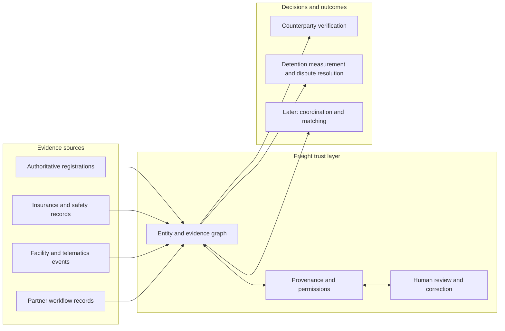
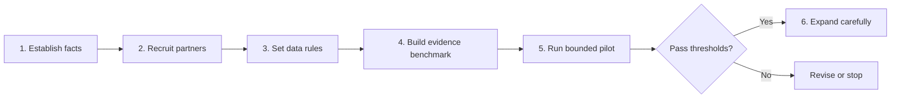
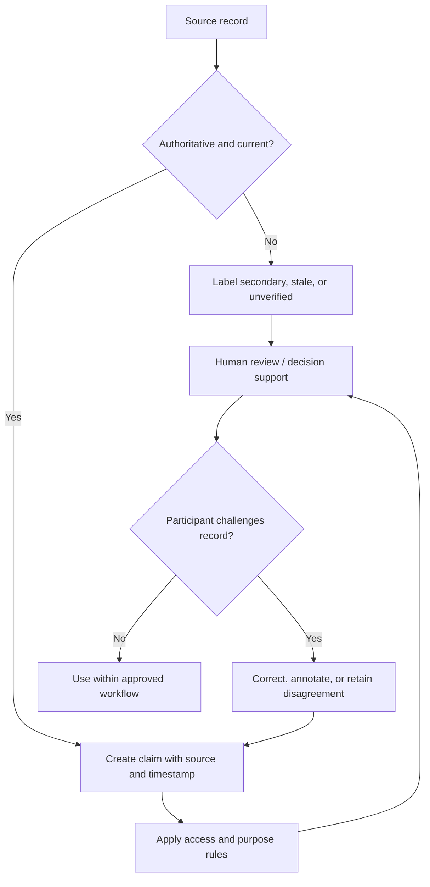
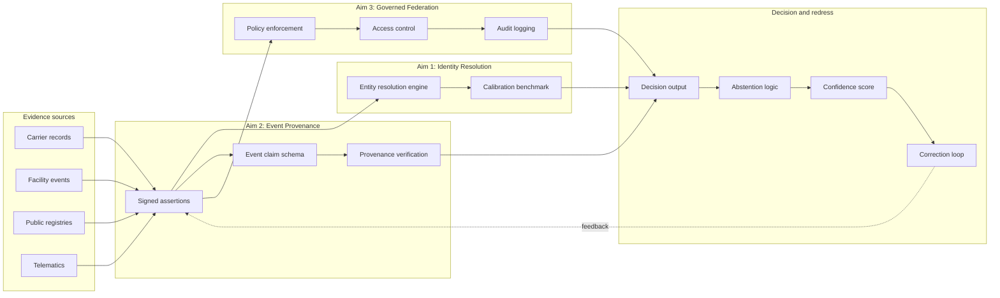

# Visual Index

The editable Mermaid source files are kept alongside this index. The diagrams below render natively in Obsidian; use the linked `.mmd` file to reuse a diagram outside a note.

## Freight-trust system

Source: [[01-freight-trust-system.mmd]]

## Pilot roadmap

Source: [[03-pilot-roadmap.mmd]]

## Evidence-governance loop

Source: [[04-evidence-governance-loop.mmd]]

## Phase I technical architecture

Source: [[06-phase1-technical-architecture.mmd]]

## Phase I work plan

Source: [[07-phase1-work-plan.mmd]]

Gantt chart showing 12-month Phase I schedule across three research aims, integration and pilot, customer discovery, and reporting milestones (dates illustrative; shift to actual award start).

## Other reusable visuals

- [[02-stakeholder-pushback-map.mmd]] — stakeholder posture quadrant.
- [[05-regulatory-timeline.mmd]] — regulatory and funding timeline.
- [[08-sbir-submission-map.mmd]] — NSF SBIR proposal document flow and vault-note mapping.

