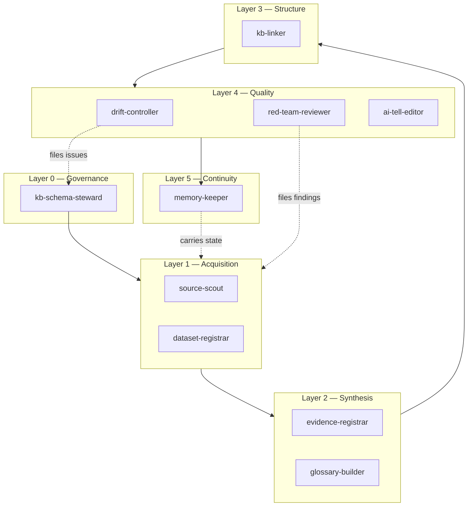

# Agents and Loops

The build system for this vault: five layers of agents and four loops that drive them,
under one rule — an agent produces structure and finds problems; a human decides. Every
canonical, platform-neutral executable definitions live in
[[05-agent-system/runtime/runtime-moc]]. Local Claude, Codex, Cursor, and MCP adapters are
generated or installed from those tracked specifications; credentials and machine-specific
configuration remain local. This note holds the architecture and the contract between the layers.

This supersedes nothing in [[05-agent-system/framework]] — the Terra/Luna/Rabbit roster
described there is the *research* control plane for a single investigation pass. The
layers below are the *knowledge-base* control plane, running continuously underneath it.

## Layer map



Work flows down; problems flow back up. An agent never edits a layer above it.

## Layer 0 — Governance

**`kb-schema-steward`** owns [[kb-schema]] and [[tag-taxonomy]]. It validates frontmatter,
type vocabularies, identifier uniqueness, naming, and folder placement. It proposes
migrations when the schema changes and never performs a MAJOR migration without a
[[decision-log]] entry. It is the only agent permitted to edit the schema files.

*Runs:* on demand, and as the first step of every loop.

## Layer 1 — Acquisition

**`source-scout`** finds and verifies external sources: standards, statutes, agency
documents, industry publications, peer-reviewed work. It writes `source-*.md` cards
carrying class, access mechanism, licence, `accessed` date, and verification status
including the failure mode when retrieval fails. It reports confirmed absence with the
scope of the search. It never paraphrases a source it could not retrieve.

**`dataset-registrar`** does the same for data products and maintains [[dataset-index]].
It records access mechanism, licence text (or its absence), refresh cadence, schema,
fields, and above all the gap between what a dataset contains and what a claim needs it to
contain. The existing `dataset-*.md` cards and the two dataset scans are its house style.

*Run under:* L2 (source refresh) and L3 (build-out).

## Layer 2 — Synthesis

**`evidence-registrar`** turns retrieved sources into claim-level entries in [[evidence]]
using the [[artifact-contracts]] evidence schema: proposition, source, class, support,
limits, confidence, freshness. It enforces the admission rules in [[methodology]] and
refuses claims that fail them, filing a `GAP-###` instead.

**`glossary-builder`** maintains [[glossary]]. It extracts terms actually used in the
vault, defines each from a cited source rather than from general knowledge, records
aliases and disambiguations, and links each term to the notes that depend on it. A term
whose definition cannot be sourced is admitted as `action/needs-source`, not invented.

## Layer 3 — Structure

**`kb-linker`** owns the graph. It resolves every `[[wikilink]]`, reports dead links and
orphans, enforces the three-hop reachability rule from [[start-here]], maintains MOC
membership, and applies [[tag-taxonomy]] tags to notes missing them. It also builds the
backlink expectations in both directions: every claim-bearing note links to its evidence,
every evidence entry lists its consumers.

## Layer 4 — Quality

**`drift-controller`** detects rot: cross-document contradictions, stale dates, schema
violations, orphaned placeholders, broken identifier references, and unreviewed
`action/` tags. It writes to [[drift-control]] with a severity and a proposed fix, and it
does not apply fixes to anything a human owns.

**`red-team-reviewer`** attacks claims rather than prose: overreach, insufficient support,
entailment failures, freshness, equity blind spots, and scope creep. It files findings in
the [[artifact-contracts]] review-finding format. It is the descendant of the Review Agent
role in [[05-agent-system/03-review-agent]] and inherits its standing objections.

**`ai-tell-editor`** removes LLM-statistical prose without touching facts, hedges,
citations, or structure. Definition in `.claude/agents/ai-tell-editor.md`. It runs last in
any pipeline, because rewriting prose before the facts settle wastes the pass.

## Layer 5 — Continuity

**`memory-keeper`** carries state across sessions. It appends to [[run-log]], records
durable choices in [[decision-log]], keeps [[gap-register]] and [[drift-control]] current,
and writes the small set of facts worth surviving into the assistant's persistent memory.
It is the reason a loop can stop mid-flight and resume without re-deriving context.

## The four loops

### L1 — Drift sweep

*Cadence:* start of every working session, and before any external send.
*Chain:* `kb-schema-steward` → `kb-linker` → `drift-controller` → [[drift-control]].
*Exit:* every new issue has an ID, a severity, and an owner. Severity-high issues block
the session's publishing steps until triaged.

### L2 — Source refresh

*Cadence:* monthly, and unconditionally before submission.
*Chain:* `drift-controller` (selects everything past `review_by`, plus every
`verification: retrieval-failed` and `snippet-only` card) → `source-scout` /
`dataset-registrar` re-verify → `evidence-registrar` updates confidence and freshness →
`memory-keeper` logs.
*Exit:* no reviewer-facing claim rests on a source older than its `review_by` or on a
retrieval that has never succeeded.

This loop has real work waiting: the FMCSA L&I and MCMIS catalog pages, the Company Census
File licence text, the FMCSA chameleon-carrier Report to Congress, PIERS licence terms,
OpenCorporates pricing, and the FCRA statutory window are all currently unconfirmed.

### L3 — Build-out

The construction loop. *Cadence:* iterative, runs until [[gap-register]] is empty of
`priority: high`.

1. `memory-keeper` loads state; the loop picks the highest-priority `GAP-###`.
2. `source-scout` and `dataset-registrar` acquire, under [[methodology]] §1.
3. `evidence-registrar` admits what qualifies; files a new gap for what does not.
4. `glossary-builder` captures new terms; `kb-linker` links and tags.
5. `red-team-reviewer` attacks the result.
6. `ai-tell-editor` cleans the prose.
7. `kb-schema-steward` validates; `memory-keeper` closes the gap and logs.

*Exit per iteration:* the gap is closed, downgraded with a reason, or converted into a
decision request. A gap is never closed by writing prose around the hole.

### L4 — Readiness gate

*Cadence:* before any submission or external delivery.
*Chain:* placeholder burn-down across the SBIR package → solicitation-fact re-verification
→ `red-team-reviewer` full pass → `ai-tell-editor` on everything tagged
`audience/reviewer` → final `drift-controller` sweep.
*Exit:* zero `action/blocker` tags, or an explicit human decision to proceed with named
exceptions recorded in [[decision-log]].

## Invocation

Agents are Claude Code subagents in `.claude/agents/`. A newly added definition is
registered at the next session start.

```
# single agent
"Use source-scout to verify the FMCSA MCMIS catalog page and update its card."

# a loop
"Run L1 drift sweep."
"Run L3 build-out on GAP-004."
```

Cadence loops (L1, L2) can be automated with the `/loop` skill or scheduled as routines.
Scheduling is a human decision — no recurring job is created without one.

## The governing rule

An agent that cannot complete its task honestly **stops and files**. It does not fill a
placeholder, soften a caveat, resolve a source conflict by preference, or manufacture an
edit count. A stopped agent with a well-formed issue is a successful agent.

## Related

[[meta-moc]] · [[methodology]] · [[drift-control]] · [[gap-register]] · [[05-agent-system/agent-system-moc]]
