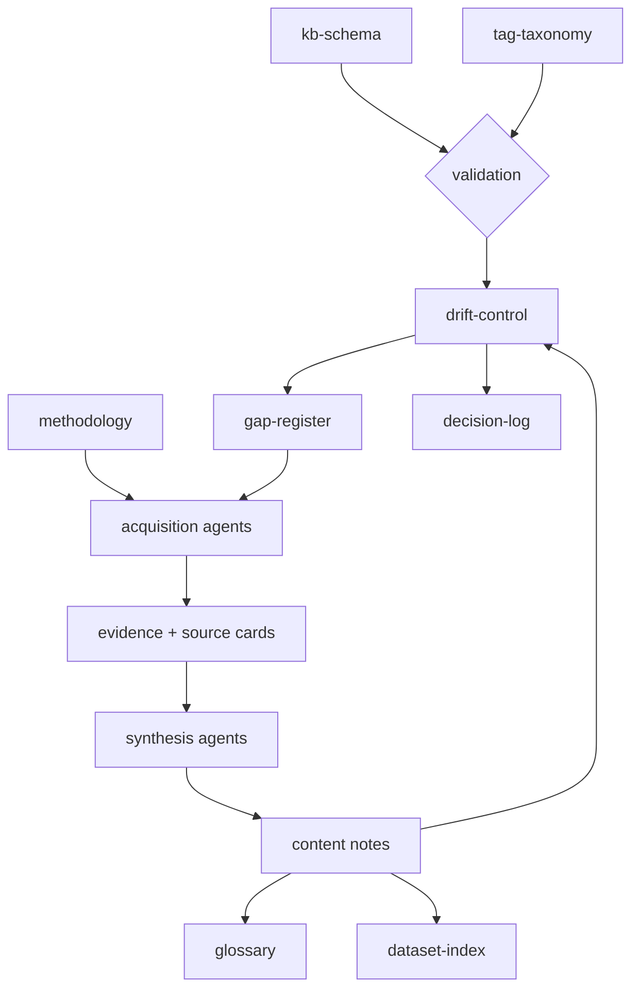

# Meta MOC — how this vault is built and kept true

`09-meta/` is the vault's control layer. Everything else in the knowledge base is content;
this folder is the machinery that keeps the content structured, sourced, linked, current,
and honest. It is deliberately separable from freight: the content serves the Freight
Trust programme, the machinery is reusable across any domain
([[client-common-action]] explains why the split was drawn).

## The control layer

| Note | Owns |
|---|---|
| [[kb-schema]] | Note types, frontmatter contract, status ladder, confidence ladder, identifier namespaces, link contract, validation rules |
| [[tag-taxonomy]] | Seven independent tagging layers and the query recipes over them |
| [[methodology]] | How a claim gets into the vault: sourcing policy, confidence assignment, adjudication, reproducibility |
| [[agents-and-loops]] | The agent layers and the four control loops that build and maintain the vault |
| [[drift-control]] | What can rot, how it is detected, and the open issue queue |
| [[gap-register]] | The build-out backlog — what is missing, ranked, with acceptance criteria |
| [[decision-log]] | Durable human decisions and their rationale |
| [[decisions/decisions-moc]] | New atomic decision records; historic log migration path |
| [[gaps/gaps-moc]] | New atomic gap records; historic register migration path |
| [[drift/drift-moc]] | New atomic drift records; historic register migration path |
| [[glossary]] | Controlled vocabulary, with each term sourced |
| [[dataset-index]] | Every external dataset, with access, licence, and verification status |
| [[client-common-action]] | Who the work is for, and what about them is still unknown |
| [[06-team-memory/memory-moc]] | Operational and episodic team memory, handoffs, tasks, and agent runs |

## How the pieces fit

The loop closes: drift and gaps feed acquisition, acquisition feeds content, content is
re-validated. Nothing enters the vault except through [[methodology]], and nothing stays
in it that [[drift-control]] cannot re-verify.

## Reading order for someone new

1. [[start-here]] — the content vault.
2. This note — the machinery.
3. [[methodology]] — the rules a claim must satisfy.
4. [[kb-schema]] and [[tag-taxonomy]] — the shape every note takes.
5. [[agents-and-loops]] — who does the work and on what cadence.
6. [[gap-register]] and [[drift-control]] — what is currently wrong or missing.

## Standing constraints

These outrank any agent instruction and any convenience.

- **No invented facts.** Every statistic, source, licence, date, and organizational
  detail traces to a retrievable source or is marked `[PLACEHOLDER]`. An agent that
  cannot find a fact reports the absence; it never fills the hole.
- **Confirmed absence is a finding.** "No such dataset exists, and here is where we
  looked" is more valuable than silence and must never be softened into "not found yet".
- **Retrieval failure is recorded, not hidden.** HTTP 403, JS shells, paywalls, and
  agreement gates are documented with their failure mode.
- **Placeholders are load-bearing.** They mark real unknowns with real owners. Never
  fill one to make a document look finished.
- **Frozen material stays frozen.** `08-archive/` is never updated toward current facts.

## Related

[[start-here]] · [[05-agent-system/agent-system-moc]] · [[03-research-evidence/research-evidence-moc]]
